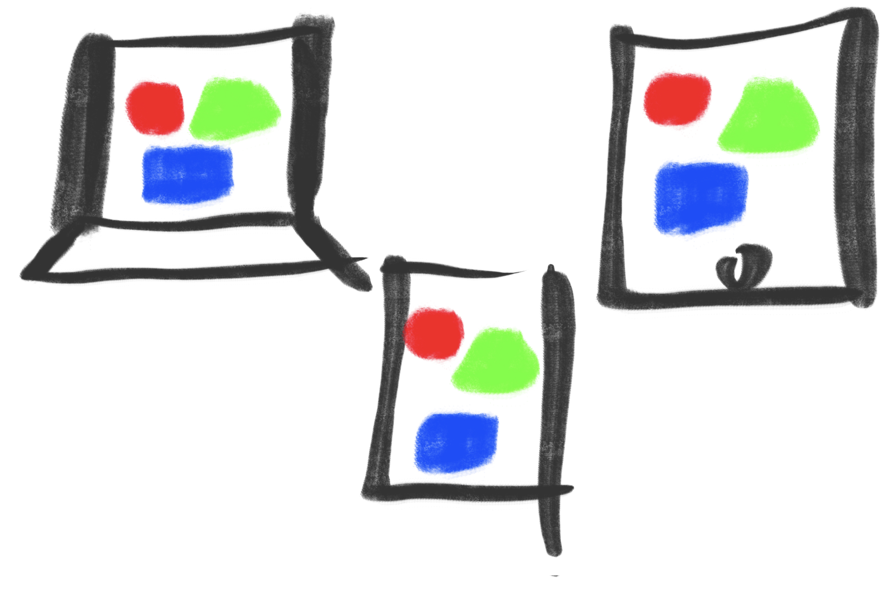
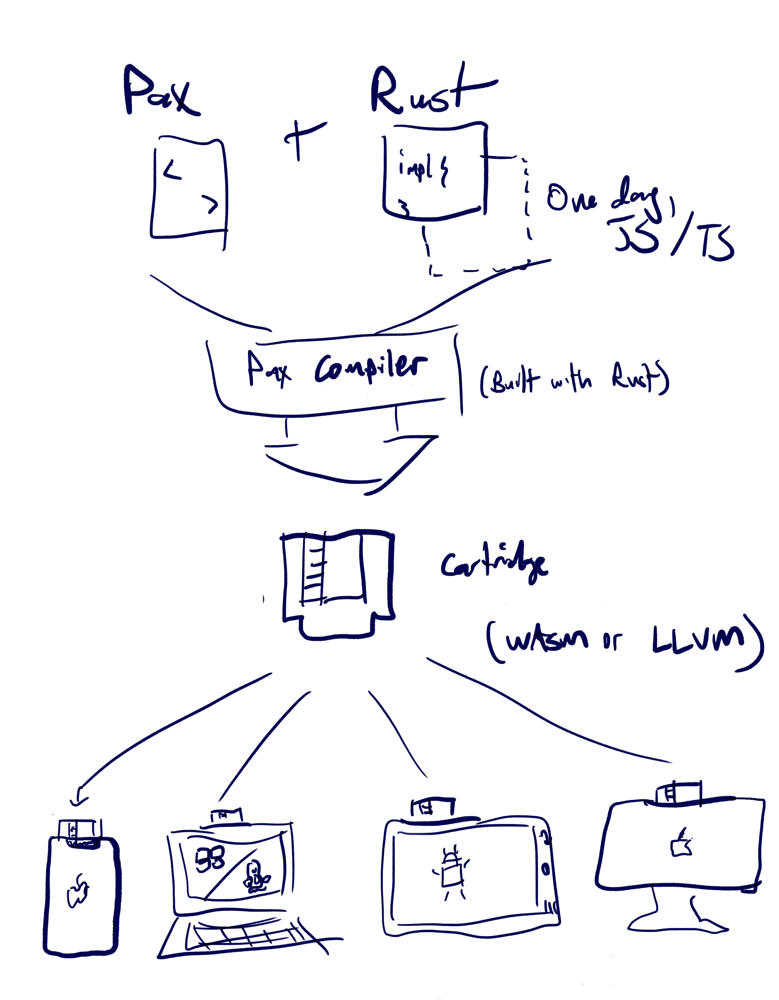

# Pax

Pax is a language for cross-platform computer graphics and user interfaces.

Pax can be authored on its own in `.pax` files (in the spirit of `.html` files), or it can _snap on_ to a Rust codebase for application logic.  Pax compiles into stand-alone native apps for all supported platforms.

Though Pax has zero dependencies on Web technologies — no WebViews, no JS runtime, no DOM — it aims to achieve the same openness, approachability, and universality as Web technologies.

#### Use-cases:

**Today:**
  - _Write once deploy anywhere_ native GUIs: desktop, mobile, web
  - Interactive 2D graphics, data visualization
  - Generative and procedural art, digital experimental media

**Future:**
  - Webpage-style content, documents, articles
  - Interactive cartoons, animations
  - 2D and 3D games, VR experiences
  
  



### Low-level, fast, and universal

Every program made with Pax compiles via Rust to machine code: Web Assembly in browsers and LLVM for native platforms. It's very fast and very light-weight. (up to 120FPS rendering, target <100KB runtime disk footprint)

Native techniques are applied maximally, including for text rendering, form controls, and scrolling.

### Ergonomic and fun to use

Inspired by standards like JSX, HTML, SVG, CSS [and others](#inspiration), Pax aims to be intuitive, familiar, and hopefully even fun to write.

Note: until additional host languages (like JavaScript) are supported, any application logic attached to Pax must be written in Rust.

### Sky's the limit

Pax is designed to extend and support _anything you can imagine_ on a screen — from 2D to 3D to VR/AR, embedded multimedia, and more.

Ultimately, Pax is aimed at enabling visual creative tooling — Pax's _raison d'être_ is to enable art and artists alongside developers.

> Note: Today Pax is in alpha, supports GPU-primitive 2D vector graphics, and has working development harnesses for Web (WASM) and native macOS (Swift).  See [the roadmap](TODO.md).


## Basic example

First let's look at some Pax by itself:

```jsx
// Pax
// src/stand-alone.pax
<Rectangle size=[100px, 100px] fill=Color::rgb(100%, 0, 0) transform={
    anchor(50%, 50%) * align(50%, 50%) 
}/>
```

You may notice that this code looks a lot like HTML, XAML, or JSX.  The above example will simply show a 100 x 100 pixel red rectangle, centered in the viewport.

Here's another example including Rust and interactivity:

```rust
// Rust
// src/hello-world.rs
use pax::*;
use pax::std::drawing2D::Rectangle;

#[pax(
    <Rectangle on_click=self.handle_click transform={
        anchor(50%, 50%)   * 
        align(50%, 50%)    * 
        rotate(self.theta) 
    } />
)]
pub struct HelloWorld {
    theta: f64,
}

impl HelloWorld {
    pub fn handle_click(&mut self, args: ArgsClick) {
        let old_theta = self.theta.get();
        
        //instead of an `ease_to` animation, could set value immediately with `self.theta.set(...)`
        self.theta.ease_to(
            old_theta + f64::PI() * 3.0, //new value
            240,                         //duration of transition, frames
            EasingCurve::OutBack,        //curve to use for interpolation 
        );
    }
}
```

## TypeScript example (future)

With Pax TypeScript, this full example might look like:

```typescript
// TypeScript, speculative API
// This is not yet available
import {pax, EasingCurve} from '@pax-lang/pax';

@pax(`
    <Rectangle onClick=this.handleClick transform={
        anchor(50%, 50%) *
        align(50%, 50%) *
        rotate(this.theta)
    } />
`)
class HelloWorld {
    @property
    theta: number;
    
    handleClick(args: ArgsClick) {
        const oldTheta = this.theta.get();
        
        //instead of an `easeTo` animation, could set value immediately with `self.theta.set(...)`
        this.theta.easeTo(
            oldTheta + Math.PI * 3.0,
            240,
            EasingCurve.OutBack
        );
    }
}

```


## Current status & support

|                                         | Web browsers  | Native iOS          | Native Android    | Native macOS        | Native Windows              | Native Linux |
|-----------------------------------------|---------------|---------------------|-------------------|---------------------|-----------------------------|--------------|
| *Ready to use* [1]                      | ✅             | ⏲                   | ⏲                 | ✅                   | ⏲                           | ⏲            |
| Development harness                     | ✅             | ⏲                   | ⏲                 | ✅                   | ⏲                           | ⏲            |
| 2D rendering and UIs [2]                | ✅ <br/>Canvas | ✅ <br/>CoreGraphics | ✅ <br/>Cairo      | ✅ <br/>CoreGraphics | ✅ <br/>Direct2D             | ✅ <br/>Cairo |
| 3D rendering and UIs                    | ⏲             | ⏲                   | ⏲                 | ⏲                   | ⏲                           | ⏲            |
| Vector graphics APIs                    | ✅             | ✅                   | ✅                 | ✅                   | ✅                           | ✅            |
| 2D layouts                              | ✅             | ✅                   | ✅                 | ✅                   | ✅                           | ✅            |
| Animation APIs                          | ✅             | ✅                   | ✅                 | ✅                   | ✅                           | ✅            |
| Native text rendering                   | ✅ <br/>DOM    | ⏲ <br/>UIKit        | ⏲ <br/>android:\* | ⏲ <br/>UIKit        | ⏲ <br/>System.Windows.Forms | ⏲ <br/>GTK   |
| Native form elements                    | ⏲ <br/>DOM    | ⏲ <br/>UIKit        | ⏲ <br/>android:\* | ⏲ <br/>UIKit        | ⏲ <br/>System.Windows.Forms | ⏲ <br/>GTK   |
| Native event handling (e.g. Click, Tap) | ⏲             | ⏲                   | ⏲                 | ⏲                   | ⏲                           | ⏲            |
| Rust as host language                   | ✅ <br/>WASM   | ✅ <br/>LLVM         | ✅ <br/>LLVM       | ✅ <br/>LLVM         | ✅ <br/>LLVM                 | ✅ <br/>LLVM  |
| JS/TypeScript as host language          | ⏲             | ⏲                   | ⏲                 | ⏲                   | ⏲                           | ⏲            |
| C++/Python/etc. as host languages       | ⏲             | ⏲                   | ⏲                 | ⏲                   | ⏲                           | ⏲            |

| Legend:             |
|---------------------|
| ✅ Supported         |
| ⏲ Not yet supported |


## Get started

[Get started here](https://www.pax-lang.org/get-started) with an example project.


## FAQ


### Is there a specification for the Pax language?

Pax is currently specified by this implementation.

Pax is really an assorted bag of special-purpose languages and a runtime, which as a whole act as an application platform.
In this way, Pax is arguably similar to the assorted bag of `{HTML, JavaScript, CSS, Browsers}`.

Pax breaks down into 3 sub-languages:

#### 1. Template language
Data representing the _content_ of a scene graph or UI tree. 
Includes a provision for referencing/linking (`id=some_identifier`). 
Also includes condition/loop logic (`if`, `for`)

```
<Group>
  <Rectangle id=my_rect />
  <Ellipse id=my_ellipse />
</Group>
```

#### 2. Settings language
Data representing the _behavior_ of a scene graph or UI tree.  Similarly to HTML/CSS, settings may be _joined_ to a template by use of IDs and selectors.

```
@settings {
  #my_rect { // attaches to element with id `my_rect`
    fill: Color::rgb(100%,0,0)
    stroke: {
      width: 5px
      color: Color::rgb(0,0,0)
    }
    width: 100px
    height: 200px
  }
  #my_ellipse {
    // ...
  }
}
```

Settings may be freely inlined inside template element declarations, too:

```
<Rectangle fill=Color::rgb(100%,0,0) stroke=Stroke {color: Color::rgb(100%,0,0)} />
```

#### 3. Pax Expression language (PAXEL)

```
<Rectangle transform={
    rotate(engine.frames_elapsed / 200.0) *
    translate(in.mouse_x, in.mouse_y)
}/>
```

If you've used a templating language like JSX before, you might expect that the code within the braces above `{ ... }` is inline Rust code.  It's not.

That is PAXEL -- part of Pax, a special-purpose language for declaring computed properties in the spirit of spreadsheet formulas.  

You can create a PAXEL Expression anywhere you can declare a settings value, in `template` definitions or in `@settings` blocks.

For example the expression `self.activeColor.adjustBrightness(50%)` might live in a template:

```
<Rectangle fill={ self.activeColor.adjustBrightness(50%) } />
```
or in a settings block:
```
@settings {
  #my_rectangle {
    fill: { self.activeColor.adjustBrightness(50%) }
  }
}
```

The Pax compiler builds all expressions to machine code, managing each as its own compiled function in a vtable.

Because Pax Expressions are pure, side-effect free functions, the Pax runtime can make aggressive optimizations: caching values
and only recomputing when one of the stated inputs changes.  Expressions are also readily parallelizable, a prospective future performance optimization.

PAXEL is very similar to at least two existing languages: Microsoft's Excel spreadsheet formula language, and Google's Common Expression Language (CEL). PAXEL shares the following characteristics with CEL[3]:

> **memory-safe**: programs cannot access unrelated memory, such as out-of-bounds array indexes or use-after-free pointer dereferences;
> 
> **side-effect-free**: a PAXEL program only computes an output from its inputs;
> 
> **terminating**: PAXEL programs cannot loop forever;
> 
> **strongly-typed**: values have a well-defined type, and operators and functions check that their arguments have the expected types;
> 
> **gradually-typed**: a type-checking phase occurs before runtime via `rustc`, which detects and rejects some programs that would violate type constraints.

PAXEL has a tighter, more specialized scope than CEL and carries a much smaller runtime footprint.


### What is Pax's footprint?

As of the current authoring, the WASM bundle for a very basic Pax app is about 150kb including several known unnecessary libraries, embedded strings, and other cruft.
100kb should be easily achievable and is a reasonable long-term goal.  <50kb is a stretch-goal.

Baseline memory (RAM) footprint is on the order of 50MB; this has not yet been optimized.

CPU has not been well profiled (TODO:) but stands to be improved significantly, especially through rendering optimizations.

### Who is behind Pax?

The first versions of Pax were designed and built by [an individual](https://www.github.com/zackbrown), but that individual's desire is for Pax to be community-owned.

Thus, even from its earliest days, Pax is stewarded through a non-profit: the [Pax Language Foundation](https://foundation.pax-lang.org/).  [Reach out on Discord](https://discord.gg/4E6tcrtCRb) if you would like to help with the non-profit.


## Inspiration

Pax draws design inspiration from, among others:
- Verilog, VHDL
- Macromedia Flash, Dreamweaver
- The World Wide Web, HTML, CSS
- React, Vue, Angular
- Visual Basic, ASP.NET
- VisiCalc, Lotus 1-2-3, Excel
- The Nintendo Entertainment System


## Art credit

[DALL-E 2](https://openai.com/dall-e-2/) by OpenAI


## Footnotes

[1] Note that Pax is currently in alpha and should only be used in settings where that's not a concern.

[2] Native 2D drawing that _just works_ on every device — with a very light footprint — is available thanks to the admirable work behind [Piet](https://github.com/linebender/piet).

[3] Text modified from source: https://github.com/google/cel-spec/blob/master/doc/langdef.md

---


## Get started

[Get started here](https://www.pax-lang.org/get-started) with an example project.


---

## Contributing

See [TODO.md](TODO.md).  There are also generous TODOs sprinkled throughout the codebase.  There may be undocumented nuance or intention behind certain aspects of the project — feel free to strike up a conversation on [Discord](https://discord.gg/4E6tcrtCRb).

## Development

### Running the project, with debugger support

`./serve.sh`

Then attach to the `pax-dev-harness-macos` process using your IDE or debugging client.
(TODO: make these instructions Linux and Windows friendly)

### Environment setup, web chassis

- Install `wasm-opt` via `binaryen`:
   ```shell
   brew install binaryen
   ```

- Install 'wasm-pack' via:
   ```shell
    curl https://rustwasm.github.io/wasm-pack/installer/init.sh -sSf | sh 
   ```

- Install `node`: https://nodejs.org/en/download/

- Install `yarn`:
   ```shell
  # if necessary: sudo chown -R yourusername /usr/local/lib/node_modules 
  npm i --global yarn
   ```

### Environment setup, macOS chassis

(TODO: make more thorough)
- Install xcode, command line utils


## Appendix A: Anatomy of a Pax component

Every Pax program defines a _component_.  That component may be mounted full-window into an app, imported and used by other Pax programs, or (future) be embedded as a UI component in existing (non-Pax) codebases, e.g. as a React component or a SwiftUI View. 

For visual reference, consider again the following example, which declares a component called `HelloWorld`:

```rust
//Rust
use pax::*;
use pax::drawing2D::Rectangle;

#[pax(
    <Rectangle on_click=self.handle_click transform={
        anchor(50%, 50%) *
        align(50%, 50%) *
        rotate(self.theta)
    }/>
)]
pub struct HelloWorld {
    theta: f64,
}

impl HelloWorld {
    pub fn handle_click(&mut self, args: ArgsClick) {
        let old_theta = self.theta.get();
        
        //instead of an `ease_to` animation, could set value immediately with `self.theta.set(...)`
        self.theta.ease_to(
            old_theta + f64::PI() * 3.0, //new value
            240,                         //duration of transition, frames
            EasingCurve::OutBack,        //curve to use for interpolation 
        );
    }
}
```

#### Template and settings

`<Rectangle fill=/*some value*/> ...`

Each component declares a template in an XML-like syntax, which describes how its UI should be displayed.  Any element in that template can have its settings assigned as XML key-value pairs.

Settings can also be declared separately from the template, in the style of HTML + CSS:

```
@template {
    <Rectangle id=my_rect />
}

@settings {
    #my_rect {
        fill: Color::rgb(100%, 100%, 0)
        height: 200px
        width: 200px
    }
}
```

#### Expressions

Properties can have literal values, like `transform=translate(200,200)` or `fill=Color::rgba(100%, 100%, 0%, 100%)`

Or values can be dynamic *expressions*, like:
`transform={translate(200,y_counter) * rotate(self.rotation_counter)}` or `fill={Color::rgba(self.red_amount, self.green_amount, 0%, 100%)}`

The mechanism behind this is in fact an entire language, a sub-grammar of Pax called 'Pax Expression Language' or PAXEL for short.[*]

PAXEL expressions have _read-only_ access to the scope of their containing component.
For example: `self.some_prop` describes "a copy of the data from the attached Rust struct member `self.some_prop`"

PAXEL expressions are noteworthy in a few ways:
- Any PAXEL expression must be a pure function of its inputs and must be side-effect free.  
- As a result of the above, PAXEL expressions may be aggressively cached and recalculated only when inputs change.
- In spirit, PAXEL expressions act a lot like spreadsheet formulas, bindable to any property in Pax.

#### Event handlers

`on_click=self.handle_click` binds a the `handle_click` method defined in the host codebase to the built-in `click` event which Pax fires when a user clicks the mouse on this element.  Events fire as "interrupts" and are allowed to execute arbitrary, side-effectful, imperative logic.

It is in event handlers that you will normally change property values (e.g. `self.red_amount.set(/*new value*/)`, where `self.red_amount` is referenced in the Expression example above.)

Pax includes a number of built-in lifecycle events like `pre_render` and user interaction events like `on_click` and `on_tap`.

[*] PAXEL is similar to Google's Common Expression Language (CEL), but CEL was not a suitable fit for Pax due to its footprint — being written in Go, CEL adds
a prohibitive overhead to compiled binaries (1-2MB) vs. Pax's total target footprint of <100KB.  Pax also has subtly distinct goals
vs CEL and is able to fine-tune its syntax to make it as ergonomic as possible for this particular domain.


## Appendix B: Description of native rendering approach for text, certain other elements

Rather than introduce virtual controls at the canvas layer, Pax orchestrates a layer of native
controls as part of its rendering process.  This native overlay is used both for form controls like checkboxes
and drop-downs, as well as for rendering native text.

In the browser, for example, a pool of DOM nodes is created for form control elements and text.
Those elements are positioned as an overlay on top of any canvas rendering, allowing for a cohesive
experience that blends dynamic graphics (e.g. vectors, animations) with native familiar UI elements (e.g. text boxes.)

[Visual of DOM "marionette" overlay layer on top of parallaxed graphics layer]

TODO: describe benefits of this approach toward a11y, because e.g. full DOM + content is present in the browser


## Appendix C: Declarative and designable

At first glance, Pax templates look quite a bit like familiar templating languages like React/JSX.

On closer inspection, you may notice an important distinction: _Pax's templates are not evaluated within a closure_ — they are declared statically and evaluated entirely at compile time.  
Symbols in expressions that refer to a component's properties, like `color=self.active_bg_color`, are handled via special runtime lookups
in the expression vtable — again, specifically _not_ a direct reference to some `self` in the scope of some closure.

Because the template is evaluated entirely at compile-time, the template is exactly what it is described to
be in the code — or in other words, it is both _code_ and _data_, in the same sense as Lisp.  Expressions themselves, given their functional constraints,
are roughly equivalent to formulas in spreadsheets: declarative, easy to isolate, easy to hack.

The reason _all of that_ matters is because Pax was **designed to be designed** — in the sense of "design tools" that can read and write Pax code as a comprehensive
description of any visual content, design, prototype, document, production GUI, or scene.


## Appendix D: Tic-tac-toe example

```
//Tic-tac-toe example
<Spread direction=Horizontal cell_count=3 >
  for i in 0..3 {
    <Spread direction=Vertical cell_count=3 >
      for j in 0..3 {
        <Group on_jab=handle_jab with (i, j)>
          if self.cells[i][j] == Cell::Empty {
            <image src="blank.png">
          }else if self.cells[i][j] == Cell:X {
            <Image src="x.png" />
          }else if self.cells[i][j] == Cell::O {
            <Image src="o.png" />
          }
        </Group>
      }
    </Spread>
  }
</Spread>
```


## Appendix E: Alike and unlike the World Wide Web


Pax's design draws much inspiration from HTML and CSS. In fact, Pax aims to offer
a compelling alternative to Web technologies for delivering cross-platform content, graphics, and GUIs.

#### Inspired by the World Wide Web, Pax is:

content-first -- like HTML
easily machine parsable -- like HTML and CSS
backwards-compatible -- works with any modern browser
universal -- compiles to any device as native app
learnable -- familiar patterns, aims to be easy to pick up
easily deployed -- wrap any program as a as native app or publish to web (JAM stack friendly)


#### What does Pax do differently than the World Wide Web?

built-in expression language -- any property in Pax — like a Rectangle's background color — can be set as an Expression: a spreadsheet-function-like that evaluates dynamically at runtime.  For example, you can react to user inputs or changes in state.
high performance -- not only are Expressions extremely efficient, Pax programs run as "close-to-the-metal" LLVM or WASM code, without the runtime overhead of a garbage collector or interpreter.  
predictable layouts -- Pax dreams of being designed. It uses the coordinate system of common design tools as well as predictable rules for alignment and affine transforms.     
language-agnostic -- built on Rust, can support JS or any other language
extensible -- built around reusable components, down to the standard library. Rendering targets (2D/3D/etc.) and target platforms (iOS/Android/Windows/etc.)
compiled -- rather than interpreted.  TODO: describe alternative to `right-click, view source`
doesn't require a browser or a JavaScript runtime — though Pax is backwards compatible with any modern browser, it can also be packaged as stand-alone native apps for any supported platform.
designable


#### Today and future

**Today** Pax is a GUI language for Rust applications, plus native and web wrappers for easy multi-platform deployment (à la Electron and React Native in the Web world.)  It supports rich 2D graphics and drawing, text, interactions, an intuitive templating language, and platform-native form controls for macOS, iOS, and web browsers.

(Today you can use Pax to create GUIs and dynamic graphics for Rust applications, which can be deployed into native apps for iOS, macOS, and the Web (via WASM.))

**In the future,** Pax aims to be:
- Language agnostic: support JavaScript/TypeScript/Python/C++ and any number of other host languages
- (this converges on the Support Matrix, which also communicates "today" vs. "future")


## Appendix F: Imagine if...

...HTML/CSS were redesigned from scratch, with a few important paradigm shifts:

- **Any property can be a computed `Expression`**, a spreadsheet-like formula that can perform basic operations and refer to other values.  In practice, this feels like "JSX meets a spreadsheet."  [Read more about PAXEL](#)
- **Graphics- and GUIs-first,** rather than Documents-first.  Cartesian coordinates, first-class horizontal & vertical alignment, responsive sizing.
- **Native-first:** transpiles through Rust, which runs everywhere natively inside app wrappers (similar to Electron, React Native — but without JS runtimes.)  Text and form controls are rendered natively; scrolling is handled natively.


## Appendix G: How does Pax work cross-platform?


<!-- TODO: refine; caption -->

------


## Get started

[Get started here](https://www.pax-lang.org/get-started) with an example project.