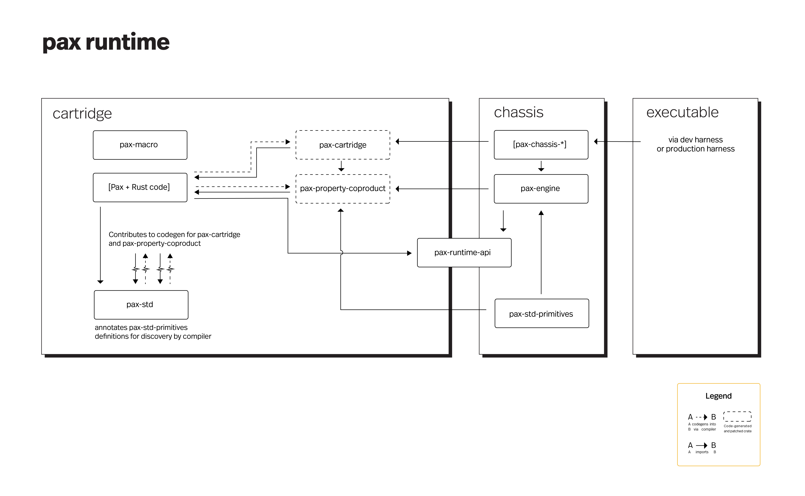
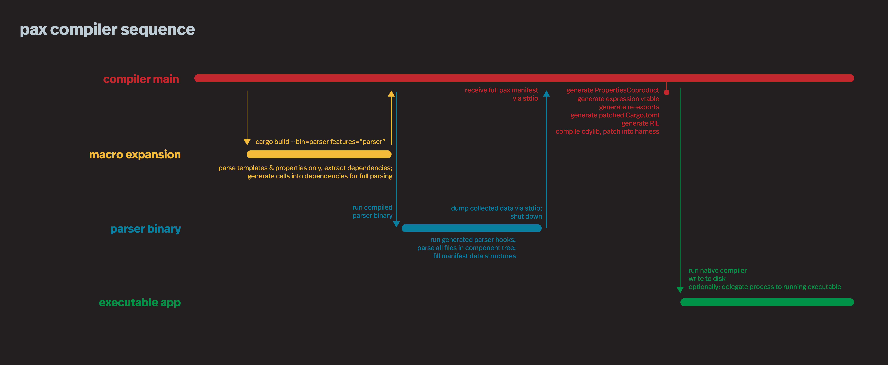

# Pax  

Pax is a user interface language and rendering engine.  Use Pax to build GUIs and interactive 2D graphics with Rust.

Pax compiles through Rust into native Mac apps (LLVM) or Web apps (WebAssembly). Support for more platforms is planned, at least: Linux, Windows, iOS, and Android.

As of September 2022, Pax is being developed in the open, [in alpha preview](https://docs.pax-lang.org/status-sept-2022.html).


## Example

Writing Pax is intended to feel familiar, and the language borrows many ideas from [prior art](https://docs.pax-lang.org/intro-goals-prior-art.html).

Following is a simple Pax component called `IncrementMe`:

```rust
//increment-me.rs

use pax::*;
use pax_std::{Text};
use pax_std::forms::{Button, ArgsButtonSubmit};
use pax_std::layout::{Stacker};

/// Following is the description of a simple form GUI, encapsulated 
/// into a reusable component called `IncrementMe`.

#[pax(
  <Stacker cells=2>
    <Text>{"I have been clicked " + self.num_clicks + " times."}</Text>
    <Button @submit=self.increment>"Increment me!"</Button>
  </Stacker>
)] 
pub struct IncrementMe {
  pub num_clicks: Property<i64>
}
impl IncrementMe {
  pub async fn increment(&self, args: ArgsButtonSubmit) {
    let old_num_clicks = self.num_clicks.get();
    self.num_clicks.set(old_num_clicks + 1);
  }
}

```
Any Pax component like the example above may be included inside other Pax components, or may be mounted as the root of a stand-alone app.

See a more thorough and [a running example](https://docs.pax-lang.org/intro-example.html).

## Features

 - **Fast** — native rendering targeting 120FPS animations
 - **Accessible** — supports native screen readers for text & GUI elements
 - **Lightweight** — targeting <100kB baseline for WebAssembly binary 
 - **Declarative** UI language makes it easy to reason about complex scenes and GUIs
 - **Reusable component system** includes an optional standard library of GUI components
 - **Multi-platform** — currently supports building Web apps or native macOS apps

## Docs
Read more in [The Pax Docs](https://docs.pax-lang.org/)


## Getting Started

Refer to the [guide for getting started](https://docs.pax-lang.org/start-creating-a-project.html) in the Pax docs.

## Current status & support

Pax is in **alpha-preview** and is not yet viable for building apps — read [the latest status](https://docs.pax-lang.org/status-sept-2022.html).


#### Support matrix:

|                                         | Web browsers  | Native iOS          | Native Android    | Native macOS        | Native Windows              | Native Linux |
|-----------------------------------------|---------------|---------------------|-------------------|---------------------|-----------------------------|--------------|
| Development harness & chassis           | ✅             | ⏲                   | ⏲                 | ✅                   | ⏲                           | ⏲            |
| 2D rendering and UIs                    | ✅ <br/>Canvas | ⏲ <br/>CoreGraphics | ⏲ <br/>Cairo      | ✅ <br/>CoreGraphics | ⏲ <br/>Direct2D             | ⏲ <br/>Cairo |
| 3D rendering and UIs                    | ⏲             | ⏲                   | ⏲                 | ⏲                   | ⏲                           | ⏲            |
| Vector graphics APIs                    | ✅             | ⏲                   | ⏲                 | ✅                   | ⏲                           | ⏲            |
| 2D layouts                              | ✅             | ⏲                   | ⏲                 | ✅                   | ⏲                           | ⏲            |
| Animation APIs                          | ✅             | ⏲                   | ⏲                 | ✅                   | ⏲                           | ⏲            |
| Native text rendering                   | ✅ <br/>DOM    | ⏲ <br/>UIKit        | ⏲ <br/>android:\* | ✅ <br/>SwiftUI      | ⏲ <br/>System.Windows.Forms | ⏲ <br/>GTK   |
| Native form elements                    | ⏲ <br/>DOM    | ⏲ <br/>UIKit        | ⏲ <br/>android:\* | ⏲ <br/>SwiftUI      | ⏲ <br/>System.Windows.Forms | ⏲ <br/>GTK   |
| Native event handling (e.g. Click, Tap) | ✅             | ⏲                   | ⏲                 | ✅                   | ⏲                           | ⏲            |
| Rust host language                      | ✅ <br/>WASM   | ⏲ <br/>LLVM         | ⏲ <br/>LLVM       | ✅ <br/>LLVM         | ⏲ <br/>LLVM                 | ⏲ <br/>LLVM  |
| JS/TypeScript host language             | ⏲             | ⏲                   | ⏲                 | ⏲                   | ⏲                           | ⏲            |

| Legend:             |
|---------------------|
| ✅ Supported         |
| ⏲ Not yet supported |


## License

© 2022 The Pax Foundation [contact@pax-lang.org].

This project is licensed under either of:
- [MIT license](LICENSE-MIT)
- [Apache 2.0 License](LICENSE-APACHE)

at your option.

## Development

### Environment setup

Use `rustc` 1.65.0 via `rustup`


### Optional environment setup, web chassis

- Install `wasm-opt` via `binaryen`:
   ```shell
   brew install binaryen
   ```

- Install 'wasm-pack' via:
   ```shell
    curl https://rustwasm.github.io/wasm-pack/installer/init.sh -sSf | sh 
   ```

- Install `node`: https://nodejs.org/en/download/

- Install `yarn`:
   ```shell
  # if necessary: sudo chown -R yourusername /usr/local/lib/node_modules 
  npm i --global yarn
   ```

### Optional environment setup, macOS chassis

- Install xcode, command line utils

### Running Development Environment

First, refer to [the latest project status](https://docs.pax-lang.org/status-sept-2022.html)

The current leading edge of development is in the compiler —
```
cd pax-compiler
./run-example.sh
```

To run `pax-example`'s parser binary and print its output to stdout:
```
cd pax-example
cargo build --bin=parser --features=parser
```

To run a full, compiled Pax example you must check out an older branch and run the demo there.  
```
git checkout jabberwocky-demo
./run.sh # or ./run-web.sh
```

To initialize the docs submodule, for super-grep powers:

```
git submodule update --init --recursive
```

As needed, review the [git submodule docs.](https://git-scm.com/docs/gitsubmodules)


### Architectural Reference


<div style="text-align: center; font-style: italic;">Runtime dependency & codegen graph</div>
<br /><br /><br />

<div style="text-align: center; font-style: italic;">
Pax compiler sequence diagram | <a href="https://www.github.com/pax-lang/pax/blob/master/pax-compiler/">Compiler source</a>
</div>
