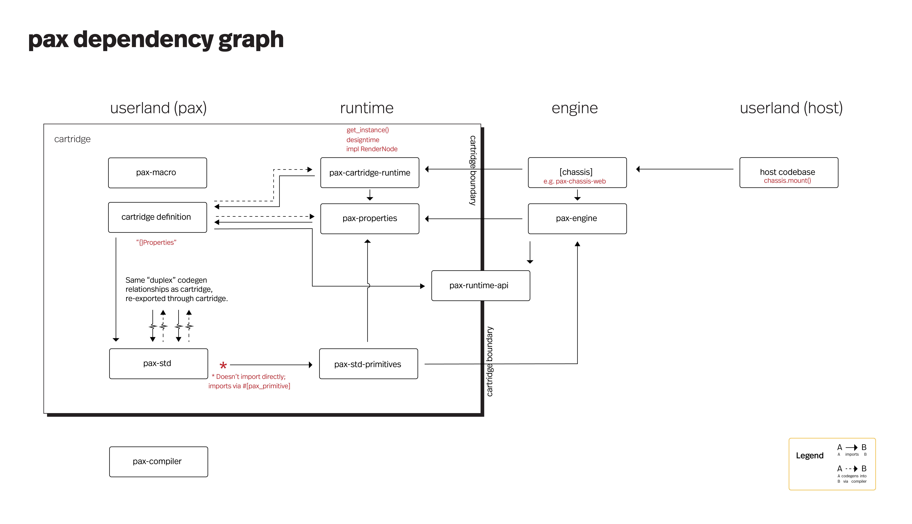

# TODO


## Milestone: proof of concept engine

```
[x] Rendering 
[x] Components 
[x] Logging
[x] Stroke, color, fill
[x] Sizing
    [x] Browser resize support
    [x] None-sizing
    [x] Transform.align
    [x] Transform.anchor
[x] Expression engine
    [x] variables, declaration & storage
    [x] node IDs
    [x] summonables
    [x] built-in vars like frame count
    [x] MVP rust closures + manifest of deps
[x] Spreads (née Stacks)
    [x] Decide `primitive` vs. userland `components`
    `components`
    [x] Internal template mechanism for components
    [x] Make `root` into a component definition
    [x] Control-flow `slot` (`slot`) for inputs/children
    [x] Ensure path forward to userland `slots`
    [x] Clipping & Frames
    [x] Control-flow `repeat` for cells & dividers inside template
    [x] Gutter
[x] Split out userland code
    [x] Add a third project to workspace, the sample project
    [x] (Further work to be done via compiler task)
[x] Timelines, transitions
[x] Refactors
    [x] Bundle Transform into "sugary transform," incl. anchor & align; consider a separate transform_matrix property
    [x] Is there a way to better-DRY the shared logic across render-nodes?
e.g. check out the `get_size` methods for Frame and Spread
    [x] Maybe related to above:  can we DRY the default properties for a render node?
Perhaps a macro is the answer?
    Same with `scale`
    [x] Can we do something better than `(Box<......>, Box<.......>)` for `Size`?
    [x] Rename various properties, e.g. bounding_dimens => bounds
    [x] Take a pass on references/ownership in render_render_tree — perhaps &Affine should transfer ownership instead, for example
    [x] Better ergonomics for `wrap_render_node_ptr_into_list`
    [x] Evaluate whether to refactor the `unsafe` + PolymorphicType/PolymorphicData approach in expressions + scope data storage
```

## Milestone: Spread

```
[x] decide on API design, expected GUI experience
    - Direction (horiz/vert)
    - Gutter
    - Cell widths
[x] expose a Spread element for consumption by engine
[x] accept children, just like primitives e.g. `Group`
[x] author an internal template, incl. `slot`ing children and `repeating` inputs
    <Frame repeat=self.children transform=get_transform(i)>
        <Slot index=i>
    </Frame>
    - need to be able to define/call methods on containing class (a la VB)
    - need to figure out polymorphism, Vec<T> (?) for repeat
    - need to figure out slot — special kind of rendernode?
[x] Frame
    [x] Clipping
[x] Slot
[x] Repeat
    [x] "flattening yield" to support <Spread><Repeat n=5><Rect>...
    [x] scopes:
        [x] `i`, `datum`
        [x] braced templating {} ? or otherwise figure out `eval`
            - Code-gen?  piece together strings into a file and run rustc on it?
            * Can achieve this with Expressions for now
        [x] calling "class methods" from templates, e.g. <Repeat n=5><Rect color="get_color(i)"
            * Can achieve with expressions
[x] Scopes & DI
    [x] Figure out dissonance between:  1. string based keys, 2. struct `Properties`
        and figure out how this plays out into the property DI mechanism.  Along the way,
        figure out how to inject complex objects (ideally with a path forward to a JS runtime.)
            - Option A:  write a macro that decorates expression definitions (or _is_ the exp. def.) and (if possible)
                         generates the necessary code to match param names to elsewhere-registered dependency streams (Angular-style)
            - Option A0: don't write the macro (above, A) yet, but write the expanded version of it by hand, incl. string deps (present-day approach)
                         ^ to achieve "DI," does this require a hand-rolled "monomorphization" of each expression invocation?
                         Or does a string dependency list suffice?  If the latter, we must solve a way to pass a data-type <D> through PolymorphicValue
                         Probably the answer is the _former_ — write the DI-binding logic manually alongside a string dep list (roughly how the macro unrolling will work)
    [x] Support getting self (or Scope) for access to Repeat Data
        - use-case: translate each element within a `repeat` by `i * k`
    [x] Quick pass on other relevant data to get from Scopes
[x] Layout
    [x] Primary logic + repeat via expression
    [x] Parameterize:
        - Gutter
        - (come back later for overrides; ensure design supports visual UX)
```

## Milestone: expressive RIL, hand-written

_RIL means Rust Intermediate Language, which is the
"object code" — i.e. compiler backend target — for Pax.  As the name suggests, RIL is valid Rust
(specifically, a subset of Rust.)  Pax relies on
`rustc` (via `cargo`) to convert RIL "object code" to machine code._

```
[x] Compile base cartridge
    [x] Refactor PropertiesCoproduct to its own module
    [x] Sanity check "patch" ability for "blanks" (Properties, Expressions)
    [x] Demo app chassis running example project (`./serve.sh`)
        [x] Add stub macro for `pax`, derives
[x] baseline primitive(s) for hello world
    [x] import/package management
    [x] RIL -> PAX compatibility, port primitives
        [x] Repeat, path from @foreach
[x] hand-write RIL first!
    [x] Handle control-flow with codegen
        [x] support with manual RIL, port old primitives
            [x] @for
                [x] syntax
                [x] with/out enumeration (`i`)
                [x] figure out scoping, e.g. addition of symbols to namespace, collision management
                [x] RepeatItem: manage scope, properties
            [x] @if
            [x] slot
            [x] frame
    [x] rendering hello world
    [x] proof of concept (RIL) for expressions
    [x] handle expressable + nestable, e.g. Stroke (should be able to set root as Expression, or any individual sub-properties)
    [x] proof of concept (RIL) for timelines
        [x] running on assumption that the problem is isomorphic to the Expression vtable problem
    [x] proof of concept (RIL) for actions
        [x] pax::log
        [x] `Tick` support (wired up)
        [x] pencil in `Click`, but don't worry about raycasting yet (or do naive raycasting?? easy to PoC!)
        [x] sanity-check Repeat
    [x] port Repeat, etc. to latest RIL
[x] API cleanup pass
    [x] make consistent Size, Percent, Anchor, Align
    [x] finish-line @if
    [x] support in-.rs-file pax, as alternative choice vs. code-behind file
```

## Milestone: imported .pax

```
[x] Spend some cycles ideating demo deliverables/storyboard
[x] Port Spread to be a pure component
    [x] figure out importing mechanism for core and/or other std primitives
        [x] Group, Slot (e.g. from Core)
        [x] Frame (e.g. from std — though if easier could just move to Core)
    [x] port spread logic; design expression/method approach
        [-] pure expressions + helpers?
        [x] on_pre_render + manual dirty checking?
            [x] decision: no dirty checking at all for right now; expose imperative dirty-check API only when implementing dirty checking for Expressions
    [x] hook in existing layout calc logic
[x] Import and use Spread in Root example
    [x] update example .pax as needed along the way
    [x] "expand the proof" of generated code & make it work manually
```

## Milestone: OSS release

```
[x] resolve the `Any` question
    [x] defer until later; reassess if it becomes clear a lot of backtracking is emerging 
[x] parser
    [x] grammar definition, PEG
    [x] parse grammar into manifest
[x] grammar/parser updates:
    [x] `@for`
    [x] ranges: literal and symbolic
    [x] `@template` block, vs. top-level
[ ] native rendering ++
    [x] message design/arch
    [ ] runtime de/serialization
        [ ] C structs across FFI
            [x] Logging, strings, message-passing
            [ ] CRUD operations and methods: PoC with `Text`
            [ ] inbound support: PoC with `Click`
            [x] flexbuffers instead of fat c structs
        [ ] consider JSON for web, alt: ArrayBuffer and manually deserialize the same C structs as chassis-macos
    [x] ids
        [x] handle monotonic, instance-unique IDs
            - expose method in engine to generate new id
            - initial use-case: instance IDs for associating engine <> native Text instances
    [ ] text support
        [x] handle_post_mount and handle_pre_unmount
        [x] trigger mount/unmount lifecycle events in engine, `Conditional`, `Repeat`
        [ ] hook up Text primitive
        [ ] handle dirty-checking for `Patch` event population
    [ ] click support
        [ ] ray-casting
        [ ] inbound event arg-wrapping and dispatch
        [ ] sketch out bubbling/canceling, hierarchy needs
        [ ] click/jab polyfill
[ ] dev env ++
    [ ] support stand-alone .pax files (no rust file); .html use-case
        [ ] dep. management -- augment prelude with static dep. list?
    [ ] support inline (in-file) component def. (as alternative to `#[pax_component_definition]` file path)
    [x] support for different example projects
    [ ] native macOS chassis + dev-harness?
        [x] pax-chassis-macos (written in rust). responsible for:
            [x] accepting a CGContext pointer and rendering to it via Piet
            [ ] managing user input channel, e.g. click/touch
            [ ] managing native rendering channel, e.g. form controls, text
        [x] mac app dev-harness (written in swift). responsible for:
            [x] granting a piece of real estate (full window of simple mac app) to rendering with a CGContext.
            [x] passing CGContext to pax-chassis-coregraphics
            [x] handling resize
            [ ] handling basic user input (e.g. click)
        [x] Debugging via LLDB
            [x] support debugging as necessary with macos dev-harness
            [x] IDE configs for each of: userland cartridge; core; std
[ ] `pax-compiler`
    [ ] update manifest-populating logic to latest parser defs
    [x] support incremental compilation — not all #[pax] expansions (namely, side-effects) are expected to happen each compilation
        [-] NOTE: provisionally, this whole group is solved as not necessary, in light of the "parser binary" feature-flagged approach
        [x] science: determine how macros behave, caching of expansion, incremental compilation
        [x] allow macros to report their registrants and the appropriate module path + file path via IPC
        [x] sweep for files that have been removed from fs; update fsdb
        [x] determine
        [x] persist fsdb to disk, probably .pax/fsdb, probably binpack
        [x] enable manual full rebuild, e.g. via `pax compile --full | --force | etc.` (should be doable via rustc with something like INCREMENTAL=0, refer to rust incremental compilation docs)
    [x] architecture
        [x] compiler seq. diagram 
        [x] dependency diagram
    [ ] two-stage compilation process
        [x] thread/process/IPC chassis
        [x] parser cargo feature
        [x] bin-running harness to execute parser (see https://stackoverflow.com/questions/62180215/renaming-main-rs-and-using-with-cargo)
        [ ] TCP message passing
            [x] de/serialization for manifest
                [x] maybe normalize SelectorLiteralBlockDefinitions, if Serde can't elegantly de/serialize it
                [x] or de-normalize TemplateNodeDefinition!
            [ ] coordination of TCP client/server from compiler main thread
        [x] parse and load .pax files
            [x] load file via macro
            [x] generate the parser bin logic via macro
                [x] manual
            [x] port minimal set of std entities (Rectangle, Group) to support manifest-gen 
            [x] traverse manifest of Component defs: parse .pax files, store in mem
            [x] (start with templates only)
    [x] thread for wrapping `cargo build`
    [x] sketch out .pax folder design
    [ ] graceful shutdown for threaded chassis (at least: ctrl+c and error handling)
[ ] expression compilation
    [ ] expression string => RIL generation
    [ ] symbol resolution & code-gen, incl. shadowing with `@for`
    [ ] binding event handlers
[ ] control flow
    [ ] @for
        [ ] parse declaration `i`, `(i)`, `(i, elem)`
        [ ] handle range literals 0..10 
        [ ] shuttle data into RepeatInstance via Manifest
    [ ] @if
[ ] user input
    [ ] mouse click
    [ ] scroll (maybe polyfill touch/mousewheel?)
[ ] compiler codegen
    [ ] codegen Cargo.toml + solution for patching
        [x] manual
        [ ] automated + file generation
    [ ] parser bin logic finish-line
        [ ] macro
    [ ] codegen PropertiesCoproduct
        [x] manual
        [ ] if necessary, supporting type parsing & inference work for TypesCoproduct
        [ ] hook into compiler lifecycle
            [ ] handle deleted files (e.g. if there's a `shadow/whatever.rs` but not a `whatever.rs`, then compiler should prune `shadow/whatever.rs`)
    [ ] serialize to RIL
        [ ] normalize manifest, or efficient JIT traversal
            [ ] stack Settings fragments (settings-selector-blocks and inline properties on top of defaults)
        [ ] codegen RIL into source via `#[pax]` macro, to enable vanilla run-via-cargo (well, pax-compiler, but maybe there's still a path to bare cargo!)
        [X] untangle dependencies between core, runtime entities (e.g. Transform, RenderTreeContext, RenderNodePtrList), and cartridge
    [X] work as needed in Engine to accept external cartridge (previously where Component was patched into Engine)
[ ] e2e `pax run`
[ ] publication to crates.io
    [x] reserve pax-lang crate on crates.io
    [ ] update relative paths in all cargo.tomls, point to hard-coded published versions
    [ ] e2e testing
[ ] launch collateral
    [ ] notify allies
    [ ] ProductHunt launch (+ other channels, incl Reddit communities)
    [ ] 
```


## Milestone: drawing++
```
[ ] Palette built-in: perhaps `@palette { optional_nesting: {  } }
[ ] Path primitive + APIs for animations
[ ] Ellipse
[ ] native clipping
    [ ] pass ClippingMask messages via `mount` lifecycle in `Frame` (etc.); track "clipping stack" in `rtc` and pass list of relevant masks for a given native element (e.g. `Text`) -- "join" clipping mask(s) with native elements by ID on the native side
    [ ] Consider whether to support arbitrary (Path) clipping masks as an alternative to `Frame`s' rectilinear ones
```


## Milestone: form controls + iOS
```
[ ] Rich text
[ ] Dropdown list
[ ] Text boxes
[ ] Databinding: event-based changes + two-way binding 
[ ] ios app dev-harness
    [ ] (~similar to mac app dev-harness)
    [ ] supporting ios simulator + physical device, however is ergonomic with xcode
    [ ] CLI hookups
```


## Milestone: capabilities++

```
[ ] asset management -- enables fonts and images
    [ ] decide on approach: bundle into binary or work with chassis/dev-harness for bundling
    [ ] support async/http assets, relative paths + configurable prefix path, absolute paths, http/https
[ ] Text++
    [ ] custom fonts: embedded or webfonts
    [ ] basic text + paragraph API
        [ ] font family, face, weight, decoration
        [ ] "rich text" or "annotated text" to support mixed content
        [ ] paragraph: left-align/right-align/justify
        [ ] (rely on `Transform` for vertical centering)
[ ] Raster images
    [ ] Sizing / clipping API (e.g. cover, or anchor + stretch/maintain/fill/target-width/target-height/etc.)
```

## Milestone: clickable square
Three "clickable squares" with independent event handlers, state
On click, each square performs an animated transformation, e.g. rotation

```
[ ] compiler updates
    [ ] `with`
        [ ] vtable + wrapper functions for event dispatch; play nicely with HandlerRegistry; add `Scope` or most relevant thing to args list in HandlerRegistry
        [ ] grammar+parser support
        [ ] single variables, with option parens (e.g. `with (i)` or `with i`, or `with (i,j,k)`)
        [ ] multiple variables in tuple `(i,j,k)`
[ ] Action API
    [x] state management (.get/.set/etc.)
    [ ] hooks into dirty-update system, for expression updates
    [x] Instantiation, reference management, enum ID + addressing for method definitions &
        invocations
    [x] tween/dynamic timeline API
[ ] revisit chassis-web implementation
    [ ] rust/JS divide
        [ ] Sandwich TS and rust (as current,) or
        [ ] handle all cartridge work from rust, incl. generation of public API
    
[ ] Event capture and transmission
    [ ] Map inputs through chassis, native events (mouse, touch)
        [ ] PoC with Web
    [x] tick event e2e
    [x] Message queue in runtime
    [ ] Ray-casting? probably
    [ ] Message bubbling/capture or similar solution
[ ] Expressions
    [ ] Transpile expressions to Rust (or choose another compilation strategy)
        [ ] boolean ops: `==`, `&&`, and `||`
        [ ] parenthetical grouping  `(.*)`
        [ ] Literals for strings, bools, ints, floats
        [ ] Nested object references + injected context
            [ ] incantation for deriving values from scope
            [ ] type-matching
            [ ] Numeric type management, casting
    [x] Write ExpressionTable harness, incl. mechanisms for:
        [x] vtable storage & lookup
        [ ] Dependency tracking & dirty-watching
            [ ] support imperative dirty-checking API too, e.g. for caching values during `prerender`
        [x] Return value passing & caching
    [ ] Sketch out design for parallelized expression computation (e.g. in WebWorkers)
    [-] Patch ExpressionTable into cartridge à la PropertyCoproduct
```


## Milestone: embedded UI components
(instead of full-window Electron/Expo-like wrappers)

```
[ ] Runtime sharing -- allow cartridges to share/sideload a runtime instead of duplicating, e.g. for 100 individual component/cartridges in a codebase
[ ] Component SDK
    [ ] per-platform userland API (`mount`)
    [ ] `component-harness` alternative to `dev-harness` for embedding
    [ ] Wire up: properties/settings, placeholders,
    
```

## Milestone: timelines

```
[ ] Hook up PropertyTimeline
    [ ] refactor easing curve packaging, probably into enum
    [ ] refactor Tweenable, to support arbitrary types (dyn Tweenable) and impl for `fsize`
    [ ] support Tweenable for f64
    [ ] support Tweenable for `Transform`
[ ] ergonomic timeline API design in pax (probably JSON-esque {30: value, 120: other_value} where 30 is frame number
```


## Backlog

```
[ ] Pax Browser
    - simple desktop app, mostly a dev harness, but also
      supports 
[ ] Revisit embedded literal strings across codebase for error messages, to reduce binary footprint (enum? codes?)
[ ] Reinvestigate Any as an alternative to Coproduct generation
    [ ] would dramatically simplify compiler, code-gen process
    [ ] would make build process less brittle
    [ ] roughly: `dyn RenderNode` -> `Box<Any>`, downcast blocks instead of `match ... unreachable!()` blocks
        [ ] ensure compatibility with `Rc`!  Circa Q4'21, Any could not be downcast to Rc (e.g. `RenderNodePtr`)
        [ ] de-globalize InstantiationArgs, e.g. `slot_index` and `data_list`
        [ ] remove PropertiesCoproduct entirely (and probably repeat the process for TypesCoproduct)
        [ ] possibly remove two-stage compiler process
        [ ] sanity check that we can downcast from a given `Any` both to: 1. `dyn RenderNode` (to call methods), and 2. `WhateverProperties` (to access properties)
        [ ] sanity check that `Any + 'static` will work with needs of `dyn RenderNode` and individual properties
        [ ] check out downcast_rs crate as way to ease?
        [ ] ensure that `'static` constraints can be met!! e.g. with dynamically instantiated nodes in `Repeat`
[ ] Designtime
    [ ] codegen DefinitionToInstance traverser
        [ ] codegen in `#[pax]`: From<SettingsLiteralBlockDefinition>
            [ ] manual
            [ ] macro
    [ ] instantiator/traverser logic (codegen or library-coded)
    [ ] duplex websocket connection + handlers
        [ ] Write ORM (and maybe caching) methods for `Definitions`
        [ ] Attach CRUD API endpoints to `Definition` ORM methods via `designtime` server
    [ ] figure out recompilation loop or hot-reloading of Properties and Expressions
        [ ] incl. state transfer
[ ] Margin & padding?
    [ ] Decide whether to support, e.g. is there a simpler alternative w/ existing pieces?
    [ ] Decide whether to support ONE or BOTH
[ ] Component-level defaults ("default masks") for properties (think: design system) -- e.g. "if not specified, all Rectangle > Stroke is _this value_"
[ ] Frames: overflow scrolling
[ ] chassis:
    [ ] macOS
    [ ] iOS
    [ ] Windows    
    [ ] Android

[ ] Gradients
    [ ] Multiple (stacked, polymorphic) fills
[ ] Production compilation
    [  ] Generation of RIL, feature-gating `designtime`
[ ] Packaging & imports
    [ ] Ensure that 3rd party components can be loaded via vanilla import mechanism
[ ] Mixed mode, Web
    [x] Rust -> JS data bridge
    [x] DOM pooling & recycling mechanism
    [ ] Text primitives + basic styling
    [ ] Native-layer clipping (accumulate clipping path for elements above DOM elements, communicate as Path to web layer for foreignObject + SVG clipping)
    [ ] Form controls
    [ ] ButtonNative (vs. ButtonGroup/ButtonContainer/ButtonFrame?) (or vs. a click event on any ol element)
    [ ] Text input
    [ ] Dropdown
[ ] JavaScript runtime
    [ ] First-class TypeScript support
    [ ] API design
        [ ] code-behind & decorator syntax
    [ ] Bindings to `runtime` API, plus IPC mechanism for triggering
[ ] Language server, syntax highlighting, IDE errors (VSCode, JetBrains)
[ ] Transform.shear
[ ] Audio/video components
    [ ] "headless" components
[ ] Expression pre-compiler
    [ ] Enforce uniqueness and valid node/var naming, e.g. for `my_node.var.name`
    [ ] Parser for custom expression lang
[ ] Debugging chassis
[ ] Perf-optimize Rectangle (assuming BezPath is inefficient)
[x] Should (can?) `align` be something like (Size::Percent, Size::Percent) instead of a less explicit (f64, f64)?
```

```
Creative development environment
for makers of
graphical user interfaces
```





## zb lab journal

### untangling Definitions, Values, and Patches
2022/01/27

We need "patches" to support stacking of sparse
definitions, e.g.  {foo: "bar"} + {baz: "qux"} => {foo: "bar", baz: "qux"}

How do these patches come to bear between .pax and the runtime?
Where do Expressions (and the exptable) fit in?
`Patch`ing also requires Default fallbacks — where do _those_ slot in?

Perhaps Patches can be combined (a la overriding `+`), and can
be distilled into values.  Perhaps a component, e.g., `Root` supports
`apply_patch(&mut self, patch: RootPatch)`

Where does this logic live (which feature/lifecycle stage?)
Seems like `designtime` is the key.  Not needed for runtime
(action value setting can be a different concern with a lighter footprint)

Two flavors of instantiating Definitions:
 - transpiling into RIL (hard-coded N/PIT; once & done) (where "N/PIT" means the "Node/Property Instance Tree")
 - dynamic traversal into N/PIT for designtime
    - accept changes in definitions
      - special handling for Expressions/exptable
    - separate definitions from values (e.g. maybe `patch`es for each?)
       Note: e.g. `Root` vs. `RootPatch` already does this; Root is a "value" container (can rep. patch)
       Perhaps start with use-case:  we need to `Patch`-stack in order to assemble sparse property
       DEFINITIONS from pax, e.g.
    - Do we really need to worry about values at all?  Those are already handled well by the runtime.
       when a user changes

One wrinkle re: managing the patch-stacking logic in the designtime:
this would require dynamic evaluation in order to generate RIL.
Which shouldn't strictly be necessary.  RIL SHOULD be
generatable directly from a PaxManifest. (Is this true?
is this some sort of purity-for-purity's-sake situation?)

Perhaps it isn't so bad for the compiler to load the cartridge + designtime in order
to traverse the manifest => 

1. normalize PaxManifest (into a single traversable tree with inline property values as frames of the bare structs, ready for RIL
   1. This requires collapsing stacked values, probably in a way that's distinct from the way the designtime does it (designtime deals in stacks of patches, vs RIL transpiler dealing with a normalized tree)
   2. This also requires transpiling + "blank"ing in an Expression table
   3. This also requires knowing property schema in the Manifest!  Thus far this hasn't been a thing.
      1. Need a way to universally qualify types, a la module_path!() [this might be tricky!]
      2. Alternatively, could do another bin-conversion trick a la parser, and rely on macros to make sense of property types on-the-fly
         1. (Note: it will be important to know property schema eventually, not least to expose to design tool)

Conclusion: further dynamic evaluation is unideal; requires more compilation loops

### expressions
2022-01-28

transpile @ {x + 5} into |&properties| -> { &properties.x + 5 } along with glue/injection logic,
dirty-handling logic, and vtable-like logic for storing & retrieving function (references)

handle type resolution as much as necessary; let rustc complain about type mismatches/etc. 

Expressions need to be dealt with in a few ways:
- parsed from 1. a template attribute, 2. a settings value (recursively within settings tree)
- looked up by ID, in RIL and in the DefinitionToInstance traverser
- hooked into with dirty-watching system, along with dependency DAG (choose which expressions to re-eval, when)
- future: hot-updated, via server message + recompiled binary/state-pass, when running the cartridge (compiler run mode, design tool)


- originally was thinking of a central vtable a la propertiescoproduct
  - this would make hot reloading easier (just replace the expressions sub-cartridge) — but it makes referencing difficult
    - maybe referencing isn't difficult with implicit return types!!
- am now thinking that each file generates its own expanded macros (via #[pax])
  - during compiler codegen phase, expressions are transpiled, surrounded by glue, and tagged/ID'd
  - for RIL, weave a code-genned pointer between a property instance and function (known from manifest)
    - e.g. `background_color: PropertyExpression(&expression_table.ae25534efc)`
  - for dynamic resolution, e.g. in designtime -
    - First of all, what does dynamic resolution mean?
      - It starts with a compiled cartridge + `designtime` feature, (already including RIL binary?) — which must already have an expression table compiled! (or capable of having it async loaded, FFI/etc.)
      - Then, a user changes the value of a property from a literal to an expression, or changes the definition of a current expression
      - Now, we must: 1. transpile the expression values to RIL, 
- if it yet becomes the case that we need to deal with explicitly stated return types on the expression lambdas:
  - expose fully qualified types in `pax_exports`, then track fully qualified import paths (e.g. pax_std::exports::foo) in manifest
  - expose naked functions at the root of codegenned `expression_table`, like  
```
pub fn x(input: isize) -> isize {
    input + 6
}
```
- (cont.)
  - where the return type of the codegenned function is fully qualified via the nested-mod re-exports trick
  - (and where primitive types are enumerated & special-cased)
  - This likely also requires registering `DeeperStruct`s, e.g. via `#[pax struct]`


### helpers, injectables
2022-01-28

e.g. Engine.frames_elapsed, or a userland helper function hue_shift()

API thought: can continue the `#[pax ...]` convention, decorating a function declaration like so:
```
#[pax helper]
pub fn hue_shift() {
    //gather an entropic hue value from the world
}
```


### on RIL generation, consumption
2022-01-31

How is the generated RIL consumed?
 - Chassis reaches into cartridge and calls a method to get root component instance(s)
 - Chassis then passes instance to the Engine to start rendering


Is this the right time to rethink instance management? Could fix the
mess of Rc<RefCell<>> going on in core.

Broadly, instances could be stored centrally in some Vec<dyn RenderNode> (or hash)
This instance pool allows for safe passing of &mut throughout core

Finally, RIL can instantiate via this instance pool 

...

Update, after spending a day on revamping instance management (progress on branch zack/valiant-rc-refactor-jan-2022), it's not currently tenable.
The lifetime tangle through core/runtime/stackframes/properties/RenderNode is beyond my current skill to fix.
Rc<RefCell<>> is not a bottleneck problem, aside from aesthetics and a minor runtime penalty (noting that
an equivalent lifetime-based solution would still effectively reinvent RefCell via the InstancePool)


SO: for RIL, proceed with on-the-fly Rc<RefCell<>> instantiations, just like PoC renderer code


### on circular dependencies, PropertiesCoproduct
2022-02-02

Despite moderately careful planning, we've ended up with a circular dependency between:
 - userland cartridge
 - core
 - properties-coproduct
 - userland cartridge (to wrap properties types)

Ideas for mitigation:
 - codegen RootProperties _into_ pax-properties-coproduct instead of inline to the source file
   - Main drawback: this requires "ghosting" every type, annotating each subtype (or globally unique type name manifest)
   - Note also: the codegenned logic will depend on `runtime`, via `timeline` (at least) (`timeline` -> `Property` -> `RenderTreeContext` -> `Runtime` -> `Stack` -> `StackFrame` -> `PropertiesCoproduct`)
     - Could separate Timeline from Property, maybe — or revisit `compute_in_place` to see if something other than `RenderTreeContext` could be injected
 - Slight variation: generate a separate cartridge/blank project `pax-cartridge`
 - Split common dependencies from `core` & `cartridge` into `runtime` — it can be a leaf-node dependency of both, allowing common data structures/exchange
   - Some """driver""" logic may even need to jump over to cartridge, e.g. `Scope` and its dependants
 - If all of `runtime.rs` logic is moved into PropertiesCoproduct — this might be fixed!
   - (plus Timeline, plus Property... plus RenderTreeContext?)
   - (plus ComponentInstance...)

As a broader strategy, could step back and look at the architecture of Engine,
more carefully drawing boundaries between Runtime, Property, Timeline, Core, and PropertiesCoproduct

### on properties
2022-02-06

In userland, e.g. an Action, properties:
 - can read properties programmatically with .get()
 - can set properties programmatically with .set()
    - not v0, but would be nice to have a path to someday setting values other than literal values, e.g.
      to create Expressions and Timelines at runtime
In engine, properties:
 - need to `compute_in_place` (whether literal, timeline, or expression)
 - need to represent whether a property is literal, timeline, or expression
 - need to `read` the current (cached) value
 - need to instantiate with a starting value
 - need to support runtime mutations via userland `.set()`, plus accurate up-to-the-frame value retrieval via `.get()`
 - have dependencies on engine, via InjectionContext and `compute_in_place` parameters

Further: PropertiesCoproduct frames need to encapsulate Properties *instances* (the engine variant, if there are two variants)
        which suggests a dependency on Engine wherever {}Properties are generated

Are these Properties data structures the same or different?  The rubber meets the road in RIL —
are the macro-generated RootProperties/RectangleProperties and PropertiesCoproduct entities the same?

Note it's easier to generate RectangleProperties alongside Rectangle in cartridge-userland, but 
with an engine dependency they seem to need to exist in fully code-genned cartridge-runtime...

One possible tool to share the core Property definition is to split Property, PropertyLiteral,
PropertyExpression, and PropertyTimeline into pax_runtime_api (importable by both Engine & userland) — 
then to write traits/impls that allow engine to `compute_in_place` and `read`

*^ proceeding with this strategy*

#### Re: Transform as a Property —
 - Transform has a special method in the rendering lifecycle, `compute_matrix_in_place`.
 - This is called in a subtly different context than `compute_in_place` for computableproperties — namely, it's called with the context of calculated hierarchical bounds (container size, etc.)
 - Further, every RenderNode is expected to manage Transform, via get_transform
 - Ergonomically, it would be ideal to treat any of the sub-properties of Transform as a plain Property,
 - e.g. so that rotation.z can be an expression while scale[x,y] are literal values
 - (Further, there seems to be no reason this can't continue recursively, with the `operations` API)

Question: given the above, should `transform` be expected as a member of `{}Properties`, or should we hoist it to be a top-level property of `{}Instance`?
 - In the world where it's hoisted to be an `Instance` property:
   - We can still `compute_in_place` by special-casing `.transform` whenever we handle `compute_in_place` for properties — 
   - that is, `.properties.compute_in_place()` and `.transform.compute_in_place()`.  To spell out further: `transform` is treated as a `ComputableProperty` in the engine
   - in every way except for being part of the PropertiesCoproduct.
 - This also suggests an opaque-to-user special-handling of Transform during compilation.  Namely,
   - the user addresses Transform just as they would any Property, e.g. through Settings and through
   - runtime .get/.set APIs.  However — in RIL and engine (.transform.set), Transform is special cased


### Transform API
2022-02-07

What's a reasonable & ergonomic API for transforms, which:
 - is terse & expressive in PAXEL
 - is terse & expressive in the action API
 - is thorough and enables specifying arbitrary transform order 
 - 
Some ideas —

#### Array for operation sequence, enums for declaring operations
```
<Rectangle id="meow">

@settings {
    #meow {
        transforms: [Transform::Rotate(Angle::Degrees(27.8))]
    }
}
```
Pros: highly expressive
Cons: verbose (esp. enums)

#### More CSS-like?
```
<Rectangle id="meow">

@settings {
    #meow {
        transform: rotate(32) scale(1.2)
    }
}
```
pros: expressive & terse
cons: new DSL


#### Recursive?
```
<Rectangle id="meow">

@settings {
    #meow {
        transform: {
            operations: [
                Transform {
                    scale: [1.2, 2.2]
                },
                Transform {
                    translate: [400.0px, 300.0px]
                }
            ]
        }
    }
}
```
Pros: expressive and aligned with RIL
Cons: verbose, esp. nesting `operations` and reincantation of `Transform`


#### fusion of operation sequence + recursive?
either accept polymorphic Transform values (array or Transform) —
or surface monomorphic top-level properties (`transform-sequence : []Transform` and `transform: Transform`)
```
<Rectangle id="meow">

@settings {
    #meow {
        transform-sequence:[
            {
                scale: [1.2, 2.2]
            },
            {
                translate: [400.0px, 300.0px]
            }
        ]
    }
}
```


#### Require transform sequences to be handled with expressions?
con: runtime penalty (maybe?  maybe it's equivalent given expression caching!)


```
<Rectangle id="meow">

@settings {
    #meow {
        transform: @{
            Transform::scale(1.4, 2.2) * Transform::rotate(120deg) * Transform::translate(200px, 100px)
        }
    }
}
```

The above is quite nice.  The single-transform case is easily handled as a literal, as is the "manually expand matrix" case,
and the "combine transform" case is easily & elegantly handled with an expression.

Can also expose a matrix2d method on Transform for manual computation:
```
Transform::matrix2d(a,b,c,d,e,f)

representing:
| a c e |
| b d f |
| 0 0 1 |
```

Another note: Kurbo's `Affine` (used for pax's 2d backends) currently handles all of this with similar
ergonomics.  Would it make sense to (selectively) expose these APIs directly (e.g. impl'ing local
traits as necessary to inject behavior) — or should there be a stand-alone glue layer between
the user-facing Transform API and the rendering Transform API?
^ decision: yes expose new middle object

Finally:  it's not so crazy to introduce a special "transform list" syntax and
supporting it with the parser, e.g.:
`transform: scale(1.5, 1.5) * translate(100.0, 100.0)`
instead of wrapping in an expression.
But it's a tiny readability difference, ultimately `@{}` vs not.

Decision:
`Size` lives alongside `Properties` and `Children` as a top-level member of an `instance`.
Design GUI can special-case these built-ins
In the (unusual) case where a size is explicitly not desired (e.g. Group), then
it must be handled as a primitive (i.e. one that defines `fn get_size() { None }`)

one more decision:
Add `position` as a property? (essentially `.x` and `.y` — but consistent with ergonomics of giving `transform` and `size` their own buckets)
This would act as an affine translation, after anchor and align calculation but before remaining transform calculation
Currently it's not necessary because `translate` is effectively equivalent.

If `position` were added, given that it's purely ergonomic (approachability), consider
whether to add aliases like `.x`, `.y`, 


### On `compute_in_place` for generated userland components
2022-02-08

Using `Spread` as a reference, `compute_in_place` manually iterates over
properties and calls `compute_in_place`.

We don't want users to worry about this; we want to autogenerate the `compute_in_place` code for
properties.  Problematically, we can only call `compute_in_place` in the cartridge runtime context
(due to dependency on engine,) but we don't currently have metadata knowledge of properties
in that context.

One possibility:  expose an iterator that returns a sequence of Box<dyn Property> (`Property<WHAT>` though)...

Another possibility: separate the `rtc` across a trait boundary, allowing a similar maneuver
as `dyn ComputableProperty` in Engine

Note also: `Spread` created its own RenderNode as its subtree root, with a single child `Component`
Should this be the general approach?  Is there a benefit to doing this?
(beyond the necessary ability to write `compute_in_place` logic for arbitrary properties,
though note that this could be generalized by exposing an iterator over

two options:
    - expose RenderTreeContext via pax_runtime_api, untangle as needed, e.g. through traits or closure-passing
    - codegen `compute_properties_fn` closures in RIL, cartridge-runtime; add properties intelligence to parser

For the former, conceptually it's a tough split.  the RenderTreeContext is squarely conceptually attached to the runtime.
The reason for the attachment is fundamentally to access StackFrame & Scope, which are used for runtime calculations (e.g. of Expressions)
Thus, and given that property schemas will need to be understood by the parser eventually:
*Decision: codegen `compute_properties_fn` closures in RIL, cartridge-runtime; add properties intelligence to parser*

We need a fn:
```
compute_properties_fn: |mut properties: PropertiesCoproduct, rtc: &RenderTreeContext|{
    if let PropertiesCoproduct::Root(mut properties_cast) = properties {
        //Note: this is code-genned based on parsed knowlege of the properties
        //      of `Root`
        properties_cast.deeper_struct.compute_in_place(rtc);
        properties_cast.current_rotation.compute_in_place(rtc);
        properties_cast.num_clicks.compute_in_place(rtc);
    }
},
```

This requires only knowing property names, not even types/import paths (extra easy)

Update: achieved apparently functional `compute_in_place` 
Next steps: pencil in second rectangle
— then bite of expressions with manually written harness code, because there's a potential design dead end
here if we hit a wall with wiring up Expressions, Properties, Scopes, etc.


### on expressions
expressions will be transpiled to Rust — so some semantics will likely
carry over, e.g. symbol names, :: for namespace access or associated functions, etc.

dependency graph: via expressions, properties may depend on other properties
Expressions may also depend on globals/constants like @frames_elapsed 
future/theoretical: expressions may depend on descendents' values, via selector (`@('#abc').num_clicks
Expressions may depend on other 'helper' expressions, or perhaps vanilla 
functions that handle their own dirty-notifications
Expressions may have no dependencies, e.g. @{ 1+1 } 

Numeric literals need special handling re: float & ints
Should cast implicitly between int/float when necessary
Perhaps study JS/AS as model

#### Symbol resolution
Symbols in scope may be:
1. properties on `self`
2. "helpers" (methods, or special macro-decorated expressions) on `self`
3. imported symbols, in scope in the context of `whatever.rs` — alternatively, maybe can capture in closure??
4. maybe "special" imported symbols, essentially a pre-imported expression `std`


Some example transpilations:

```
@{1 + 1}
1 + 1
```

```
@{
Color::rgba(
    Math::abs(
        Math::sin(num_clicks / 10.0)
    ),
    1.0,
    0.0,
    1.0
)}

Color::rgba(
    Math::abs(
        Math::sin(num_clicks / 10.0)
    ),
    1.0,
    0.0,
    1.0
)}

```

### Journey of an expression
2022-02-09 

1. authored in .pax
2. parsed by parser; lives as string in Definition object, passed from parser binary to compiler
3. transpiled by compiler —> String (of Rust code, ready for cartridge runtime)
4. codegenned into cartridge runtime, as closure in ExpressionTable

In RIl (cartridge runtime), 


### More dependency graph untangling
2022-02-10

*Property can't depend on Engine*, due to 
the inverted dependency relationship between
cartridge and engine.  This is not news, but is worth pointing out
as the crux of this issue.

Previously we tried "sideloading" behavior
via a trait, which didn't work (is there yet a way
to make this work? one possibility is to declare
`Properties` objects (like `RectangleProperties`) in
a scope that has access to the necessary bits of `rtc`

Probably solid approach A:
- remove `compute_in_place`
- give every Property a UUID — register
    uuid -> &property (maybe ComputedProperty!) in a global hashmap
    instead of compute_in_place, look up
    a given property in each of 
    `expression` global map and `timeline`
    global map.  if present, evaluate.
    What does evaluate mean here?  It means
    storing a cached computed value 
- instead of `compute_in_place`...
(this might run into the same problem with dep. graph, trait side-loading)


**Probably solid approach B:**

- keep `compute_in_place`, but pass it a `dyn`
object, e.g. of a simple `Receiver` object (probably `impl Receiver for CarbonEngine`)

- pass the property's string ID to that receiver object
when evaluating compute_in_place

- `Receiver` (probably Engine) pops from this stack
(or removes from singular register) of string ID, uses that string ID to route `rtc`
to the right table & Fn for evaluation (Expression, Timeline)


Re: storing the ExpressionTable — there's a wrinkle in that each return type for `||{}` makes for a unique
type signature.  Either we can give a PropertiesCoproduct treatment to return types — or MAYBE we can give a PropertiesCoproduct treatment to the `Fn`s themselves.

static HashMap<String, ExpressionLambdaCoproduct> {
    "aef132": ExpressionLambdaCoproduct::
}

```


get_expression_evaluator_by_id(id: &str) {
    
}
```


### on API for align

when combining transformations, align should be thought of a bit differently vs other properties.
1. it's 'global' for the scope of a sequence of transformations.  In other words, there's at most one global value of alignment per RenderNode per frame.
2. it should be applied only once, at the end of a coalesced Transform sequence.
3. the latest align in a sequence (if more than one is specified) takes precedence, replacing previous settings


compute_transform_matrix can return two values: an Affine for Align, and an Affine for "everything else."
remove multiplication of align @ compute_transform_matrix
add multiplication of align at the caller of compute_transform_matrix()


### on nestable Properties, TypesCoproduct, Types in general
2022-02-12

1. TypesCoproduct vs. PropertiesProduct — is the distinction worthwhile?

generally speaking, PropertiesCoproduct is for larger aggregate types (the set of all properties for a given component)
while the TypesCoproduct, at advent, is intended for more atomic types, specifically anything
that can be returned by an Expression.  At least, there is an expected perf benefit
(at least memory footprint, possibly also wrapping/unwrapping overhead) of breaking out
a separate coproduct for "return types"

That said — do they converge, in theory, on the same idea?  There's no provision or need for
"all properties of a component" to be expressed as a single Expression, but certainly each
individual property can be.  

Further, for compound property types like Stroke, there's a need to
express the "aggregate type" as an individual expressible Property in addition (as a mutaully exclusive option)
to addressing its subtypes as individual Properties.  In practice that probably looks like
```
PropertyLiteral > 
    PropertyLiteral
    PropertyExpression
```
for
```
stroke: {
    color: Color::rgba(255, 255, 255, 255);
    width: @{ $frames_elapsed * 0.001}
}
```

So in short, the PropertiesCoproduct and the TypesCoproduct are categorically the same thing,
and _could_ be shimmed into the same object if necessary.  That said, there's a likely
performance benefit to keeping them separate (allows TypesCoproduct operations to be
smaller in memory footprint + bandwidth, possibly also in computational wrapping/upwrapping, weight
in CPU cache)

As an important use-case, consider the Path (i.e. arbitrary bezier/segment/gap sequence)
 — it can be represented either as: a series of nodes and segment-type specifiers, or a series of "drawing commands" (a la SVG)
In design-tool land, it would be nice to be able to "direct select" a path point and express any of its properties individually — additionally,
it would be nice to support "shape tweening" between two arbitrary `Path` values

```
<Path id="my-path" />
@settings {
    @my-path {
        points: [
            {x: ,y: ,handles: [{x:y:},{x:y:}]},
            {x: ,y: ,handles: [{x:y:},{x:y:}]},
            {x: ,y: ,handles: [{x:y:},{x:y:}]},
            {x: ,y: ,handles: [{x:y:},{x:y:}]},
        ]
    }
}
```

This verbose (if as minimal as possible) description of points feels ergonomically similar to Timeline.  Consider this similarity when 
locking in API design...


### on Actions and event handling
2022-02-12

need to nail down:
 - syntax in pax
 - userland API, ease of getting/setting values (rename Property::cache_value to `set`?)

built-in lifecycle events: onclick, ontap, ontick

are there user-extensible lifecycle events? perhaps a component can trigger events,
allowing binding of events (classic BEST-style) -- e.g.:

```
<MyElement onclick=@handle_click />
```


Types: function will be expected to accept the correct types, e.g. ClickArgs for onclick
This isn't an Expression and won't be evaluated through the lense of PAXEL
The @ syntax is both conceptually correctly _different_ than `@{}` — and is a nod to the "magic splice"
nature of the decorated symbol (i.e. that @handle_click will magically (via codegen) be spliced with its
args into a complete statement in RIL)

What about binding to methods on descendents?  Perhaps `@('#some-id').some_fn` (with a hat-tip to jQuery) allows
for nested access.  Note that this extends to referring to desc. properties as well! 


#### Journey of an Action

1. defined as a `pub fn` in code-behind
2. bound to an element a la a property, e.g.: `<Group onclick=@handle_click>` or `@settings{#some-group : { onclick=@handle_click }}`
3. parsed, pulled into manifest: templatenodedefinition `x` binds event `y` to function (handler) `z`
4. generated into RIL to handle this runtime story:
   1. user clicks on screen
   2. hits either:
      1. native element (e.g. in Slots or mixed mode content) 
      2. or virtual element (canvas)
   3. for virtual elements, ray-cast location of click, find top element
   4. dispatch click event (add to message queue for relevant element(s))
      1. DECIDE: capture/bubble or something better? Might be able to avoid needing a `capture` phase if parents can add (essentially) `pointer-events: none` to children, deferring within-hitbox events to themselves (parents)
      2. What other events may be dispatched?  Tick, tap, mouseover, etc. — but what about custom events?
      3. This probably is a responsibility of RenderNode, and might offer a robust default impl. for common events.
   5. each tick, process message queue for each element.  Take a look at the lifecycle/event order here, e.g. which of `tick` vs. `click` etc. happen first (intuitively, a click's handler should fire BEFORE the next click)
   

Generated RIL needs to accept a polymorphic arg, e.g. EventClick or EventTick (args coproduct?), unwrap it,
and bind its values to a method call on the instance itself (`pub fn handle_click(&mut self, args: ArgsClick)`)

Could keep `n` different queues per node, for `n` different types of args
(requires writing queue management logic when adding new event types)

Or could keep one queue with genned glue logic for unwrapping coproduct
into args

(cont. 2022-02-14)

Probably `impl Handler<EventClick> for RenderNode`, as well as
all other built-in event handlers.  `EventCustom` might be centrally
implementable in the same way, allowing userland to deal with named
`EventCustom`s


Engine has coordinates & a RenderNode — must fire userland declared
method with correctly injected args

The method itself exists on the instance (`Rc<RefCell<dyn RenderNode>>`)

The execution of the method can be done with a closure (which can be
code-genned, and which can also be attached at runtime!)


Pass `fn` pointer — note that even for methods, the `fn` is global.
Must be resolved by global import, and probably (almost certainly)
must be passed through parser+codegen.

This fn pointer, then, can be evaluated by calling:

```

fn dispatch_event_click(args) {
    //args are passed by engine
    //probably unwrap args coproduct here
    let some_fn_pointer: fn(&mut self: RootProperties, evt: EventClick) = pax_example::handlers::some_onclick
    let mut instance = (*some_rc).borrow_mut();
    some_fn_pointer(&mut instance, args);
}
```


Each tick, the message queue will be exhausted, even if there are no
handlers bound to relevant events (i.e. `EventClick`s will propagate
in message queue but will be unhandled.)

Should handlers support being attached at runtime?  probably not, at least
while Rust is only supported language. (how to add without recompilation?)

**Click -> Chassis -> Engine queue (with known element id) 
Every tick, process queue — if the ASSOCIATED ELEMENT (via id from engine queue)
has a REGISTERED HANDLER (via .pax, or in the future perhaps added at runtime)
then TRIGGER the registered handler with chassis-generated args**

Chassis: set up native listener, instantiate relevant engine struct with data, enqueue in engine
Engine: each tick, before rendering, process event queue; dispatch events on RenderNodes
RenderNode: default impl dispatch: unwrap (match) arg/event type, 
check for any local registered handlers (&fn), fire if present (in order registered)

What about tick handlers?  tick is a little "special" because of how voluminous the events are
(60-120/s * n elements) — there's likely a bandwidth/computation overhead to processing so many
events spuriously.

Perhaps `tick` can be special-handled, checking for handlers on each element during rendering (or properties comp.) recursion
and then dispatching

Handlers: attach to instances or to definitions?
To instances.  Ex. if there are two Rectangles, each should have a separate handler for Click
Thus it follows that we want to associate handlers with INSTANCE IDs rather than component/def. IDs


#### design and code together; ship UIs to every device.


### on instance IDs, handlers, and control flow

1. inline, compiler-generated literal ids will add to cartridge footprint
2. handlers need to be able to look up element by ID (instance_registry)
3. either: a.) IDs are inlined during compilation (e.g. by the mechanism used to join expressions + properties), or b.) generated at runtime
   1. Expression IDs have to be managed at compile-time, to solve vtable functionality within Rust constraints
   2. instance_registry (instance) IDs should probably be managed at runtime, because:
      1. literal inlining takes toll on footprint
      2. dynamic primitives like if/repeat, which may dynamically instantiate children with methods/handlers, _must_ do this at runtime

HandlerRegistry<T> must be associated with e.g. RectangleProperties (<T>),
because that type T will need to be injected as `&mut self` when calling
a method/handler.

Either: bundle all HandlerRegistry<T> Ts into PropertiesCoproduct,
or store a distinct HandlerRegistry<RectangleProperties> (e.g.) per dyn RenderNode

Engine has an intent to dispatch an event,
an element ID,
and event-specific args (ArgsTick, for example.)

Look up element by id, get `dyn RenderNode`

could expose `dispatch_event()` on `RenderNode` —
challenge is passing the right `&mut self` into the registered method call.

Maybe we don't want to resolve RenderNodes with the instance_registry at all?
Can we resolve to the instance of `RootProperties`?
The answer is probably yes, because properties are stored in an Rc<RefCell<>>, which we can clone into the instance_registry

So: Engine has an id and an event, looks up id in instance_registry,
gets an Rc<RefCell<PropertiesCoproduct>>

That PropertiesCoproduct needs to be unwrapped so the right
type of &self can be passed to our stored fn.


*Important distinction:* event handlers (methods) do NOT
acept a `&self` for the element attached to the method —they accept a `&self` for
the component (or `repeat`/etc.) owning the relevant stack frame.

One possibility: generate a `HandlersCoproduct`, akin to `PropertiesCoproduct`, that generates
all of the necessary method/handler signatures (`fn(&mut RootProperties, ArgsClick)`, etc.)

Ideally, though, these pointers don't need to be stored centrally.

During code-gen, we know the context (component) to which any instance
belongs.  So it's straight-forward enough to inline a `fn` declaration, type, or container
with the right type during that inlining process.

We only care about handlers in the context of Components!


### plan for event dispatch
2022-02-18

From RIL, we can:
wrap each dispatch definition (the raw userland method call) with a closure
that takes generic (coproduct) parameters and uses
codegen to map/unwrap those parameters into the invocation.

codegen a reference to the StackFrame owner's Properties
(namely Component/RepeatItem properties)

Then:
 - de-genericize HandlerRegistry; populate with the wrapped/codegenned closures described above
 - add `get_handler_registry() -> &HandlerRegistry` to `trait RenderNode`
 - now, engine can ask a RenderNode for its HandlerRegistry, check if a given event type is registered, and dispatch the handlers if so

Re: tick, the same check can be made during properties comp (pre-`compute_in_place`, perhaps, so that any side-effects will be accounted for in the immediate next render)
in other words, `tick` is really `pre`-`tick`, esp. notable if `pre`/`post` tick handlers are later introduced.


### on scoping, @foreach
2022-02-22
consider the template fragment:

```
<Group>
    <Rectangle ontick=@handle_tick id="rect-a" />
    @for rect in rects {
        <Rectangle fill=@rect.fill />
    }
</Group>
```


when creating new scopes for @for, we have two major options:
    - Angular-style: replace scope.  would require kludgy re-passing of data into repeatable structs, far from ideal
    - more robust: additive (shadowed) scopes (req. dupe management and dynamic resolution up stack frame)
        specifically, `for` adds to scope, vs. component definitions resetting scope (cannot access ancestors' scopes, certainly not implicitly)
        duplicate symbol management: check at compile-time whether symbol names are available in shadowing scopes


logic to resolve symbol (e.g. `rect.fill`) to backing value:
    - determine whether `rect` is in current scope:
        - resolve value via `rtc` with statically baked lookup logic (code-genned)
        -


For enumeration:
```
@for (rect, i) in rects {
    <Rectangle fill=@rect.fill />
}
```

Note that this still requires the creation of `PropertiesCoproduct` entries for shadowing scopes,
which contain just 1 or two members: `rect` and `i` in the case above. (corresponding to RepeatItem's `datum` and `i`)
-- in fact, maybe not!  Perhaps just RepeatItem needs to be added, which is recursive and handles everything we need


#### What about dynamic IDs?
```
@foreach (rect, i) in rects {
    <Rectangle id=@{"rect-" + i} />
}
```
This would require dynamic application of SettingsLiteralBlock, which is currently only done at compile-time
Can this use-case be handled otherwise? Introduction of `class` would run into the same problem

Could destructure and pass a reference to a `RectangleProperties`. (`<Rectangle ...rect>` where `rect : RectangleProperties`)  Gets a bit unergonomic around optional/null

Winner:
*Can natively handle indexing at the `@settings` level, e.g. with pseudo-class like syntax:*

```
#rect:nth(0) {

}
```

This comes with a decision: *all declared IDs must be known at compile-time.*

Quick sidebar: this brings us to commit to `id` as non-unique (or to supporting `class`)

Is runtime application of SettingsLiteralBlock going to be important regardless? It's solved for the `Repeat` case.  Will we someday want
to support imperative node addition, with the expectation that new nodes matching existing selectors will be applied the 
relevant settings block?  This requires adding selector-matching logic in the runtime, as well as storing SettingsLiteralBlocks 
separately in runtime (as opposed to current flattening/inlining)

Since all known use-cases are currently handled by pre-authoring (declarative) tree permutations, this question and
refactor can be revisited at a future time where we contemplate an imperative userland scene graph mutation API


One other sidebar — since IDs are guaranteed to be static, they may as well be plain ol' `snake_identifiers` rather than `"string values"`, right?


`@foreach i in (0..10) ` 


Support literal ranges, both exclusive and inclusive `(0..=10)`

Could technically enumerate also, `@foreach (val, i) in (0..10)` but only useful (maybe useful?) in cases where the range is not (0..n)


### On instantiation in RIL

1. currently using `::instantiate` associated functions, as a way to inject side effects (registering instance in instance map.)

An alternative, robust solution is to instantiate more 'imperatively' -- instead of in one big recursive statement (RIL tree), 
instantiation can occur using vanilla object constructors and manual invocation of side effects (e.g. registration in instance_registry)

Roughly, this requires starting from the bottom of the render tree and moving upwards.  For a given leaf node, instantiate its bottom-most sibling, then each successive sibling until all children of the shared parent are instantiated.  
Recurse upwards until root is instantiated.

Disadvantage:  RIL becomes more cumbersome to read, write.  Advantage: cleaner instantiation logic.

Another option: add `instantiate` to RenderNode, thereby firming the contract of what needs to go into instantiation
(e.g. the instance_registry, the handler_registry, and properties)

*Decision: add `instantiate` to RenderNode*


### children vs template vs adoptees
2022-02-28

Refer to the following comment copied from the definition of `RenderNode`:

```
/// Return the list of nodes that are children of this node at render-time.
/// Note that "children" is somewhat overloaded, hence "rendering_children" here.
/// "Children" may indicate a.) a template root, b.) adoptees, c.) primitive children
/// Each RenderNode is responsible for determining at render-time which of these concepts
/// to pass to the engine for rendering, and that distinction occurs inside `get_rendering_children`
```

Perhaps it is worth revisiting these concepts in order to compact
the conceptual surface area.

*Template:* conceptually sound with 
 - Repeat (repeating a template, a la a stamp)
 - Component (instantiates an instance based on a template, a la a stamp)

*Adoptees:* conceptually sound with Spread, via slots
 - fits in the same struct `RenderNodePtrList`
 - instead of an "average case tree," Adoptees are an "expected case list"
 - Sequence of siblings is relevant (beyond z-indexing); used to pluck adoptees away into whatever context

*Children:* a.k.a. "primitive children," the intuitive
"XML children" of certain elements that deal with children,
such as Group, Frame, and more.
Note that adoptees are a special form of children — Spread's
`children` (per the `Component` `template` definition that declares that Spread)
are dealt with by Spread as adoptees.  

Tangential observation: the `Component` has no way of knowing whether
the children it's passing will be dealt with as `adoptees` or `primitive children`.

**So: can these concepts be compacted?**

Let's imagine establishing a rule: that a `RenderNode` may deal with its
`children` however it sees fit.  For example: it may or may not deal with
`children` as order-sensitive `adoptees`.  The management of `children` is thus
_encapsulated._

A key distinction between `template` and `children` is the authoring.  `children`
are passed as "intuitive XML children", e.g. to Repeat & friends.

`template` is a definition, currently used only by Components.  A Component may
have both a `template` (its definition) and `children` (adoptees) [but is there
ever a case where a Component instance has non-adoptee children? perhaps not!]

Given the duality above, perhaps it's worth making `adoptees` explicit?
It reinforces the notion that `children` are injected from the outside,
rather than "birthed" internally (a la a template)

Is there a case where `adoptees` doesn't make sense to describe children?
For `Group`, for example, it's awkward.  Group also doesn't use slots.
So: 
 - `children` are for primitives, e.g. for a `Group` and its contents
 - `adoptees` are specific to `Component` instances (because `StackFrame` is req'd.) that use `Slot`s
 - `template` is specific to `Component` instances


### on properties for core primitives

e.g. `data_list` for `Repeat` and `index` (and maybe someday: `selector`) for `Slot`

Currently these are being shimmed into the top-level `InstantiationArgs`, e.g. `data_list`.
This works but is a bit inelegant.  Options:

- introduce a sub-struct, essentially just a cleanliness 'module' for InstantiationArgs.
  add the relevant built-in-specific data there, like `slot_index` and `repeat_data_list`.
- generate the built-in `{}Properties` structs inside pax-cartridge,
  where they can be imported to PropertiesCoproduct (see RectangleProperties)

  

### on spread, "primitive components"

after tangling with porting Spread as a primitive, decided 
to stop for now:

It's not a great use-case to encourage (primitive + component, lots of ugliness incl. manual expression unrolling)

Instead, this is a great use-case for bundling spread.pax and spread.rs into an importable package, via pax-std

Can "manually unroll" the code for importing in pax-std in order to "derive the codegen proof"


### on demo story

// TODO
Performative coding or compelling example?
Former requires automated compiler
Latter requires "PoodleSurf" effort, plus support for images, text styling, full layouts, animations, interactions, more.

Both would be ideal for a broad audience!

What about for a more understanding niche audience?

What about showcasing designability?

### on timeline API

2022-03-03


Here's the current def. of TimelineSegment

```
pub struct TimelineSegment {
    pub curve_in: Box<dyn Easible>,
    pub ending_value: Box<dyn Property<f64>>,
    pub ending_frame_inclusive: usize,
}
```

1. needs default value (e.g. for keyframe-0 if no keyframe value is defined)
2. needs sequence of TimelineSegment
3. can be element-inline or in settings block

```
# some-rect {
    transform: @timeline {
        starting_value: Transform::default(),
        segments: [
            (15, Transform::rotate(12.0), InOutBack)
        ] 
    }
}


//more spatial, ASCII-art-like.  Mildly awkard to type/maintain, but not so bad; big ergonomic benefits, and
//UX can be improved through tooling, e.g. like the markdown table plugin in j                                                etbrains IDEs 
# some-rect {
    fill: @timeline {
        (0           ,             10,           100)
        (Palette::Red, Palette::Green, Palette::Blue)
    }
}
//how about a vertical version?
# some-rect {
    fill: @timeline {
        0: Palette::Red,
        10: Palette::Green,
        100: Color::rgba(
            100%, 100%, 0%, 100%
        ),
    }
}
//not only does the above feel more familiar a la JSON, it elegantly handles multi-line constructions like the `Color::rgba...` above.


//or horizontal with paging?


//Maybe there's ALSO a use for the horizontal syntax, for simple cases and basic constants.  It just feels good when well aligned -- more like looking at a visual timeline

# some-rect {
    fill: @timeline {
        |0            |10             |100           |
        |None         |Linear         |OutBack       |
        |Palette::Red |Palette::Green |Palette::Blue |
        
        |120          |180            |220           |
        |Elastic      |Out            |In            |
        |Palette::Red |Palette::Green |Palette::Blue |
        
        |300          |500            |800           |
        |Bounce       |
        |Palette::Red |Palette::Green |Palette::Blue |
    }
}

//That said, the apparent inability for the horizontal syntax to elegantly handle multi-line statements makes it a less
//practical choice than the vertical JSON-like syntax 


```

Note that a segment's value can be a literal (as described here with `Transform::rotate(12.0)`) or it can be an expression (e.g. `@{Transform::rotate(12.0) * Transform::translate(100.0, 200.0)}`)


### on align
2022-03-03

Currently align is a float.
Ideally it should be a percent.
Decision: port to Size, panic if px value is passed


### on dirty-checking, userland API
2022-03-04

Spread needs to update its cached computed layout as a function of its ~six properties:

pub computed_layout_spec: Vec<Rc<SpreadCellProperties>>,
pub direction:  Box<dyn pax::api::Property<SpreadDirection>>,
pub cell_count: Box<dyn pax::api::Property<usize>>,
pub gutter_width: Box<dyn pax::api::Property<pax::api::Size>>,
pub overrides_cell_size: Option(Vec<(usize, pax::api::Size)>),
pub overrides_gutter_size: Option(Vec<(usize, pax::api::Size)>),


As a single expression? (probably requires functional list operators in PAXEL, like `map`, as well
as lambdas)
```
(0..cell_count).map(|i|{
    
})
```

By surfacing an imperative API for dirty-checking?

Add to `dyn Property`
`is_fresh() -> bool`

and `_mark_not_fresh()` — but when is this called?

As a consumer, Spread wants to know whether a value is "fresh" in order
to determine whether to proceed with a calculation.

Specifically, `fresh` here means "does it have a new value since last tick," presumably
within the scope of an every-tick handler like "prerender"

Note that the Expression dirty-handling system should be able to bolt onto the same
API.  Perhaps this should be deferred to the point that system is built,
so that the major use-case (Expression dirty-checking) is handled best


Any time a value is set (and implicitly marked fresh), we need to ensure
that freshness is maintained until the next complete batch of expression calculations
is complete.  That means *at the end of the following frame* (not the current frame, which is partially evaluated)
This also means that a `postrender` handler should see `fresh` twice for a given
`set`, but `prerender` should see it only once.  Thus, by this approach,
there should be room for userland patching into `pre-render` to do manual
caching based on dirty-checking.


### On untangling Render Instances, API instances, Definition objects, Properties objects
2022-03-04

*Render nodes == instances*
Any instance will impl `dyn RenderNode`


*API instances* are `Property`-free structs used e.g. for imperative instantiation
without needing to wrap with `Box` and `PropertyLiteral`.  `Stroke` vs `StrokeProperties` is a great example.
Note that `Stroke` is not a RenderNode, and likely never would be (a RenderNode is unlikely to be managed imperatively in userlkand

*Definition objects* are used by the parser, stored in manifests

*Properties objects* are containers for node-specific, arbitrary values, conventionally
wrapped in `Box<dyn Property>` (though technically not necessarily so, e.g. perhaps for a cached or private value)

---

*A use-case,* perhaps not perfectly served by the existing ontology, is an
object that can be:
    1. easily declared with low conceptual overhead
    2. imported and used in templates in other files.  
E.g. just `Rectangle`, not `RectangleProperties` or `RectangleInstance`.  

This feels adjacent to `Stroke` vs. `StrokeProperties`, but it's re: a RenderNode
rather than a PropertiesObject.  Should there thus be an "API Instance", but
for RenderNodes?

Thus, to define a custom RenderNode, one must provide:

1. the API object, or at least symbol name (Rectangle)
2. the Properties object
3. `Instance`: if primitive, the `impl RenderNode for ...`, else `ComponentInstance` 

---

*Another use-case:*

a userland component def (e.g. Spread) may want to access not only the current node's
`properties`, but also it's built-ins like `size` or maybe even `transform`.

What does that API look like?

Consider the following excerpt:
```
pub fn handle_prerender(&mut self, args: ArgsRender) {
        
        let bounds = args.bounds;

        let active_bound = match *self.direction.get() {
            SpreadDirection::Horizontal => bounds.0,
            SpreadDirection::Vertical => bounds.1
        };

        let gutter_calc = match *self.gutter_width.get() {
            Size::Pixel(px) => px,
            Size::Percent(pct) => active_bound * (pct / 100.0),
        };

        // snip
        
    }
```

The key question: What is `self` here?
Is it the API object?  It would be the easiest to author (`impl Spread { ... }`)
Let's say it's the API object.  Can we also have the Properties available on that API object?
(This would suggest that the PropertiesObject and the API object are the same thing.
This would further suggest that RectangleProperties -> Rectangle, and that the user is responsible
for wrapping properties in Box<pax::api::Property<>> — or that the `pax` macro help in this regard
(perhaps suppressible with an arg to the macro))

So, we can reduce our surface area to:
1. Instance object (RenderNode), e.g. `RectangleInstance`
2. Properties object + API object, e.g. `Rectangle`.  Properties must be wrapped in Box<dyn Property>, even if by macro.
3. `DeeperStruct`-style nested literal objects.  These must be wrapped in `Box<dyn Property>`. 


(cont. 2022-03-07)

SO: when declaring a component instance, say `Root` or `Spread` —
1. we're declaring the `Properties + API` object (`Root` and `Spread`, with a series of `Box<dyn pax::api::Property<some_type>>` properties
2. there will be auto-generated Instance impl (or Factory, or boilerplate instantiation code)
   1. On this point — which is best?  Probably generation of Factory/Instance, both for consistency (easing codegen reqs) and for footprint (presumably lower footprint)_
3. 


### On return type for `@for (elem i) in self.computed_layout_spec`

The expression generated for this @for statement -- i.e. the expression bound to the `data_list`
property of the `Repeat` instance -- needs to return a `Vec` of _something_.

The `data_list` property for Repeat is of type `pub data_list: Box<dyn Property<Vec<Rc<PropertiesCoproduct>>>>`

So that _something_ should probably be a `Vec<Rc<PropertiesCoproduct>>`.  This means the expression needs to
remap from `computed_layout_spec` — i.e. whatever is the type of each element of that array — into a PropertiesCoproduct.

More specifically, the compiler needs to know what variant of the PropertiesCoproduct enum to wrap each element
into.  In the Spread case, it's `PropertiesCoproduct::SpreadCellProperty(elem)`

How can we know what type `SpreadCellProperty` should be?  One option is to make it static, i.e. for 
`B` in `@for A in B` to be a statically knowable symbol, present in the current scope.

One version of this constraint would be to ensure the symbol is a `Property`.  Another could
include its ability to be a method call (we can know the return types of methods from the parser via macros) 

Is it the case we will only want to support `static property` symbols and `static method calls`?
(more dynamic collections could be computed in event handlers...)  so, yes!

OK — so the parser is responsible for gathering the type attached to a symbol, incl. via shadowing,
whether the symbol is a `property` or a `method`.  We can expect that the type is wrapped in `Vec<>`
(or, perhaps, is otherwise `enumeratable`).  We should also be able to support `literal ranges` like `(0..10)` or even `(0..num_clicks)`

With this type in hand, the compiler can generate the correct Coproduct wrapper type,
e.g. `PropertiesCoproduct::SomeDiscoveredType(datum)`

Let's walk through how that gets unwrapped, as a sanity check.

Repeat will create a `Component` instance mounted with `PropertiesCoproduct::SomeDiscoveredType(datum)` as its `properties`.
Inside any expression with access to this scope, a member may be invoked, any symbol...

*The compiler is responsible once again for resolving that symbol (or throwing an error if it 
cannot be resolved) and then generating the correct "invocation" code to bind that symbol*


### On ergonomics, working with sequential data and interactions

Use-case:  from three elements repeated on a screen, when any one is clicked,
increment _that_ element's rotation, independently of the other two.

```
@template {
    @for i in (0..3) {
        <Rectangle on_click=@handle_click />
    }
}
```


Possibilities:

#### embed scope in ArgsClick

Requires unwrapping scope type in method body, no bueno

but... really... we want the fully qualified, shadow-compatible scope

if we have `@for i in (0..3)`, it would be simplest and cleanest to have access to `i`,
as well as `j` in a nested `@for j in (0..5) {`.

This is theoretically doable, with code-genned "shadowed frames" for each context
where scope may be embedded in a click arg.  In the simplest case, scope
just returns the Properties object.  If there's a `@for i in (0..3)`, any event
handler bound instead of that loop should have access to an {`i`} union {`...current_properties`}


#### embed metadata 

probably by a special syntax around handler binding
(maybe just embed index? but what about nested `for`s?)

```
@template {
    @for i in (0..3) {
        <Rectangle on_click=@handle_click with i/>
    }
}
```

might be able to embed "metadata" in the ID and parse it later, but that's kludgy

Could also add a Vec<usize> to ArgsClick, which can keep indecies (only; not data, which would really be nice to have)


#### embed args, codegen with compiler

something like:
```
<Rectangle id=r >
@for i in (0..10) {
   <Triangle on_click=@handler with (i, r)>
}
...
```
`on_click=@{self.call_method#(i)}`
`on_click=@{self.some_method | i }`
`on_click=@{def self.some_method(.., i) }`
`on_click=@some_method<i, s>`

`on_click=@some_method @(i, j, string)`
`on_click=@some_method of ..., i, j`
`on_click=@some_method with i`
^ this one is pretty nice, or:
`on_click=@{self.some_method < i,j,k }`
(pipe feels a bit more conventional...
this is adjacent to currying, but 

this would codegen a closure that "summons" `i` via the
same codegen logic used elsewhere in compiler, then
passes not only the unwrapped ArgsClick (etc.) but also
`i` (and optionally `j` or `datum` or whatever.)

In other words:
`on_click=@{self.some_method | i }`
would call at runtime
`some::namespaced::method(&mut self_instance, args_click, resolved_i)`
and
`on_click=@{self.some_method | i, j }`
would call at runtime
`some::namespaced::method(&mut self_instance, args_click, resolved_i, resolved_j)`


A major advantage of this approach is that it allows rustc
to deal with enforcing types (if `i` or `datum` isn't the right type for
the method signature of `call_method`, `rustc` will complain)

`(fn a b) ** c -> (fn a b c)`


a distinction -- currying is unary — from a given (likely nested) function, 

#### on `ref` use-cases

The `with` functionality may also support
React-style `ref` functionality, if we choose
to enable it.  

For example:
`on_click=@some_handler with some_rect_id` where `some_rect_id` is `<Rectangle id=some_rect_id>`

This would (probably) resolve to the Instance+Properties object (the PropertiesCoproduct entry) for that element.

The major family of use-cases this would open is imperative manipulations of the render tree (if we want to support this?)
and otherwise imperative manipulation/access of properties


#### on returning chunks of template from methods
"stencil"

This is a common pattern in React, for example. It allows for cleanly breaking
complex templates into smaller pieces, without needing whole new Components

```
#[pax(
    <Rectangle>
    get_dynamic_thing()
)]
pub struct Hello {}

impl Hello {
    pub fn get_dynamic_thing() {
        pax_stencil!(
            <Group>
            
            </Group>
        )
    }   
}
```

Is this a special case of grouping?  
It's roughly like minting a component, without a stack frame
Could easily be managed in a design tool as such, while maintaining
compatibility with hand-coding 

~complet? comp? precomp?~
Let's go with *stencil* for now. [edit: precomp might be better, c.f. After Effects]

What about when a stencil need to take parameters?  No problem —

```
#[pax(
    <Rectangle>
    @for i in (0..10) {
        get_dynamic_thing(i)
    }
)]
pub struct Hello {}

impl Hello {
    pub fn get_dynamic_thing(i: usize) {
        pax_stencil!(
            <Group>
                
            </Group>
        )
    }   
}
```

Note that `i` is bound from the template into the method call `get_dynamic_thing`

The compiler can weave this together in the same fashion that it handles `with`


### on adoptees
2022-03-17

Certain `should_flatten` elements, namely `if` (`Conditional`) and `for` (`Repeat`), 
need to hoist their children as a sequence of adoptees, in lieu of themselves as singular nodes, e.g.

```
<Spread>
    @for i in (0..10) {
        //shadowed scope (component) adds `i` here
        <Rectangle>
    }
    <Ellipse>
</Spread>
```

Spread should have 11 adoptees in this case

Possibly a wrinkle: the computation of `Repeat`'s children
(via `data_list`) might come later in the lifecycle than assignment
of adoptees. (Update: this was indeed a wrinkle, fixed by adding a manual computation
of adoptees' properties when they are `should_flatten` (namely for `if`, `for`))

Also take note that `Repeat` wraps each element in its own
`Component`, which will take a stack frame and which currently 

Stack frames are pushed/popped on each tick

Expose `pop_adoptee() -> Option<RenderNodePtr>` on `StackFrame` (and maybe `nth_adoptee()`)
StackFrame greedily traverses upward seeking the next `adoptee` to pop.
`adoptees` become strictly an implementation detail, meaning the field can be eliminated 
and `Component` can pass its `children` if specified to the StackFrame that it creates.  
Unpacking `should_flatten` nodes can happen at this stage, and this probably requires a linear traversal of top-level child nodes.


Spread's template in the example above might be something like:

```

@for i in self.cell_count {
    <Frame transform=@{self.get_transform(i)}>
        <Slot index=@i />
    </Frame>
}

```


Stepping back briefly...

Conceptually, when we expose slots, we're opening a "slot".  We're allowing two nodes
to be connected in our graph, a `child` (to become `adoptee`) passed to a Component, and to a contained `Slot`, which mounts that `adoptee` as its own `child`.

Spread introduces an additional `Component` into the mix, underneath `Repeat`.
There seem to be some cases where we want to traverse parent nodes
for adoptees, and other cases where we don't (e.g. a Spread
with insufficient adoptees should render empty cells, not the surplus adoptees that were
passed somewhere higher in the render tree.)

We could pipe adoptees explicily, e.g. Repeat hand-picks an 
adoptee for each ComponentInstance, attaches it to that stack frame,
and we go on our merry way.

There's also still the problem of flattening.
Repeat and Conditional could be trained to push their children directly to
a mutable StackFrame's `adoptees` list... still there's a matter of
lifecycle management, though. (will those adoptees be pushed at the
right time?)

```
<Spread>
    @for i in (0..10) {
        <Rectangle/>
    }
</Spread>
```

Could the `pre_render` hook be useful here?  Properties have already been computed:
for **this node, but not for its children** (e.g. Repeat)
So no, `pre_render` probably won't be helpful as it sits.


Probably our best bet is for the lookup to be dynamic on StackFrame itself.

1. register children to StackFrame `adoptees` naively, no unpacking
2. expose `nth_adoptee` on StackFrame, which 
   1. somehow knows when to stop traversing stack upwards to seek adoptee list (special flag on componentinstance => stackframe ? hard-coded in Repeat where it instantiates Compoennt, for example), and
   2. expands `should_flatten` nodes to compute its index lookup. naively, this can start O(n)
3. 
Where `nth_adoptee` checks all nodes for `should_flatten`, grabbing
a

Maybe there should be an explicit "adoptee delegation" operation? where a component
may delegate the responsibility of certain adoptees to a member of its template


Twofold problem:
1. adoptees need to have their properties computed, at least for top-level should_flatten

### on TypeScript support, syntax
2022-03-22

1. comment (@pax `<Rectangle ...>`)
2. JSX-style approach, extend JS/TS as a language.  Note: with a subtly different syntax, either:
   1. adjust Pax's template syntax to conform with JSX, or:
   2. fork JSX extensions (for build tooling, code editors) to support Pax

It's probably worth _embracing_ the distinction that Pax is a separate language (without closure access or side effects in `render` fn)

It's also probably worth embracing the advantage of strong typing (i.e. not worry about vanilla JS support; instead focus on TS support,) even if it diminishes the shorter-term reach of Pax.  

There is almost certainly room in the world for more robustly built, strongly typed UIs.


### on parsing story, recap/rehash
2022-03-27

1. find UI root (for app cartridge).  find explicit export roots (for app/lib cartridges). for each of these roots:
   1. parse template, discover dependencies, gen parser bin logic (`parse_to_manifest` and friends)
   2. Execute parser bin:
      1. call each root's `parse_to_manifest`, load *template*, *settings*, and *expressions* into manifest, phone home to compiler server
      2. for each dep, recurse and call that dep's parse_to_manifest
      3. finish when compiler server has all manifest info
3. transpile expressions into vtable-ready function bodies (as String), parts:
   1. invocation:
       1. importing symbols and binding values, crawling up stack as necessary
       2. casting as necessary, for types with known conversion paths (rely on Rust's `Into`?)
   2. execution:
       1. transpile PAXEL logic to Rust logic
5. Generate pax-cartridge for app cartridges only:
   1. Generate expression vtable
   2. Generate timeline vtable
   3. Generate expression dependency graph ("ROM")
   4. Generate component instance factories
   5. Generate root component instance tree
      


### on timeline vtable

are timelines just a special form of expression, where `t` is a parameter?  this fits nicely with other moving pieces,
e.g. gets dirty watching for free (lazy evaluation of timeline-bound properties, not re-evaluating when `t` doesn't change -- extensible to support Expression keyframes, too)

timeline-bound functions can live in the same vtable as expressions, then


### back to children/adoptees
2022-04-01


Consider the following Pax program:

```
Root's template: [stack frame ⍺ for Root]
A <Rectangle />
B <Spread>
C     <Ellipse />
D     <Path />
- </Spread>
  
  Spread's template: [stack frame β for Spread]
E <Repeat> // [stack frames γ0-γn for n RepeatItems]
F     <Frame>
G        <Placeholder>
-     </Frame>
- </Repeat>
```

In what order and in the context of which stack frame should properties be computed?
```
stack frame ⍺:
  A, B, C, D (visit each child, and their non_rendering_children recursively)
stack frame β:
  E
stack frames γ0-γn:
  F, G
  
```

Note that get_rendering_children for Spread will return E, so we first need to
first visit B's non-rendering children, C and D

To pull this off[1], we will need to perform two separate passes of the render tree.

The first will be to perform properties computation, and it will recurse via `get_adopted_children` 
and `get_template_children`.

The second pass will be a rendering pass, which will recurse by `get_rendering_children`


[1] (namely, without running into issues of double-computation of properties by computing
them during "adoptee" traversal, then again during "render_children" traversal, especially with the
tangles that introduces to pulling values out of the runtime stack)


//maybe:  introduce distinction between get_rendering_children and
//        ... get_(what exactly?)  get_rendering_children_that_aren't_adoptees
//        maybe this can be solved with lifecycle?  traverse node/property tree before
//        adoptees are linked as rendering_children?
//Another possibility: link a reference to stack frame to node — then it doesn't matter when it's
//                     computed; instead of peeking from global stack (in expression eval) it can start evaluation
//                     from the linked stackframe
//C:  keep track of whether a node has already been visited for a given frame;
//    track that either in `rtc` (with a unique ID per node) or on each
//    node (with a `last_frame_computed` register.)

        //Perhaps perform multiple traversals of the graph:
        // - compute properties
        //    - special-cases adoptees (calcs first) recurses via get_natural_children
        // - render
        //    - recurse via get_rendering_children


#### Cont. 2022-04-02

store a `stack_frame_offset` with component instances.  that offset should be known statically, thus can be embedded with the compiler.
traverse `stack_frame_offset` frames up the stack (backed by `unreachable!`) before evaluating expressions.
can instantiate this STACK_FRAME_OFFSET constant inside expr. instance declarations (`|ec: ExpressionContext| -> TypesCoproduct {`...)

revert changes to rendering lifecycle; traverse / compute properties / render as before.


New problem: interpolatable properties
Not all properties will be interpolatable (though a reasonable default can be trivially derived)
We will not know easily at runtime NOR compile-time (without digging into some rustc API) whether a property is interpolatable
a `default` impl (see `rust specialization rfc`) would solve this with a blanket implementation, e.g.:

```
impl<T: Clone> Interpolatable for T {
    default fn interpolate(&self, other: &Self, t: f64) -> Self {
        self.clone()
    }
}
```

BUT, that `default` is unstable, and without it rustc won't let the blanket impl live alongside concrete defs, such as:
```
impl Interpolatable for f64 {
    fn interpolate(&self, other: f64, t: f64) -> f64 {
        self + (other - self) * t
    }
}
```

Is there some way to hook into `RenderTreeContext::get_computed_value` here?
Probably so, as long as Interpolatable is defined for all built-in / common types
So that's probably the solution -- impl `Interpolatable` for all expected property types,
with a path to implementing for 3rd party types as well


### re: Message structs for native rendering

Should they be centralized or should they be decentralized (authored as part of reusable components)

Decision: because adding native rendering commands is so _centralized_ -- namely due to the need to update several native runtimes with each change in functionality -- it was thus decided to centralize 
the definitions of the drawing message structs. 


### Text

1. templating live values — naively, something like `<Text>{"Index: " + i}</Text>`.  Problem: doesn't seem like it'll extend well to support styling -- this approach is "all static literal" or "all expression", whereas we probably want a bit more nuance for text.
   1. Alternatively: `{self.inline} templating, where the contents of {self.inline + "hello"} get interpolated into this string`
2. inline styling -- at least three potential approaches:  
   1. class/id/settings, a la HTML (support sub-elements for e.g. `<span id=some_span>`)
   2. markdown or markdown subset: `**this is bold** and *this is italic {"and dynamic" + "!"}* and [this is a link](https://www.duckduckgo.com/)`
   3. built-in DSL/primitives for styling: `<b>Hello there!</b> Good to <i>see</i> you!`

Must be able to mix & match, too.

A priori, markdown-esque feels compelling -- in particular, with support for templating 


### Click events

Ray-casting: where the user clicks, 0 or more elements will be hit by a ray running orthogonally from the point of click through the bottom-most plane of the cartridge.
The _top-most_ element that is _clickable_ receives the event

An element _higher in the hierarchy_ (ancestor) should be able to suppress descendent events — this is an _override_ setting, and the highest-in-hierarchy (most ancestral) takes precedence

Use-case: when a button is clicked, handle the click with that button, but DON'T also fire the click handler for the container
Who is responsible for specifying that?  DOM approach is to call `stopPropagation` from the descendant
But we're really describing behavior of the _ancestor_ -- in a well encapsulated scenario, 
**the _ancestor_ should be responsible for discerning whether the click was "direct" or "hierarchical" and deciding whether to respond**
(rather than the desc. saying "just kidding, no event!")

An element _lower_ in the hierarchy may stop propagation imperatively with `stopPropagation()` a la DOM


### Mount events + native elements + repeat

Currently, Repeat naively re-renders the _same instances_ of elements `n` times
This is problematic specicially for native elements -- each instance that's cloned by Repeat will have the same instance_id,
which is how native counterparts are keyed & looked up

Seems that Repeat will need to do a less naive clone of elements -- perhaps RenderNode can implement `Clone` or offer `duplicate`, which copies everything but creates a new instance with new ID/etc?
Each desc. must also be cloned recursively, producing an entirely new subtree

Then, each `RepeatItem` puppeteer gets a fresh subtree, rather than pointers to the same nodes


### On tracking & identifying Repeated elements
May 6 2022


1. when an element is instantiated, there's only _one_ instance ID assigned, even if it's repeated 100 times via ancestral `Repeat`s
2. this is problematic because e.g. there will be only one `Create` event, but 100 `Update` events, all keyed to the same element ID

One hacky possibility: traverse the runtime stack, reading any `RepeatItem` frames and attaching a 'path' to each virtual instance id
Note that since we're using `int` ids, this will need to be passed as a Vec internally, and either as an int + slice or as a string across native bridge (`"15_0_0_1"`, for example)

can solve "not firing subsequent mounts" for Repeated elements by
including reduced list of `RepeatItem` indices retrieved by traversing runtime stack
Does that tuple act as a suitable, drop-in unique id?  
The major concern would be "stability" -- i.e., could the relationship between "virtual instance" and `(element_id, [list_of_RepeatItem_indices])`
    change in between `mount` and `unmount`?  Namely, if the data source changes, do we expect an un/remount?  Perhaps this can be revisited with the introduction of an explicit `key`?


TO DECIDE:
 - worth continuing to chew through FFI?
 - Or keep a simple bridge, pass serialized bytestream for MQ?

Even if we go with JSON, it's still being passed synchronously
through shared memory -- the only costs are:
 - encoding & parsing compute (time, framerate) overhead
 - encoding & parsing disk footprint (measure `serde`s footprint)

Note that if we standardize on JSON, we get a parser for free on Web, i.e. no additional disk footprint for WASM bundle.

